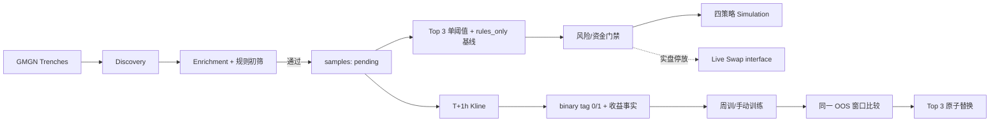

# 开发文档

> 项目：Solana Meme Quant Trading System  
> 工作目录：`D:\meme`  
> 文档基线：2026-08-10，时区 `Asia/Shanghai`  
> 技术栈：FastAPI + Python 3.11+ + SQLite + scikit-learn/XGBoost + React/Vite/TypeScript  
> 安全声明：本文只描述配置键名和协议，不包含任何 `.env` 值、API Key、私钥、签名原文或序列化交易。

## 1. 规范优先级

发生冲突时，按以下顺序处理：

1. 用户最后明确确认的业务规则；
2. `README.md` 的冻结业务口径；
3. 本文的工程和外部 API 约束；
4. `architecture_review.md` 的架构门禁与风险说明；
5. `量化训练采集.py` 仅作为旧采集实现参考；
6. `meme数据.csv` 仅是历史事实，不能反向定义新规则。

未经业务确认，不得把标签、止盈止损、持仓上限、资金公式、模型晋级、Launchpad 范围、手续费上限或实盘权限作为“技术优化”修改。必要变更应先写 ADR，说明动机、兼容性、数据迁移、回滚和测试。

## 2. 当前实现概览

### 2.1 运行拓扑

```text
React/Vite :5173
       │ /api proxy
       ▼
FastAPI :8000
  ├─ SQLite repository / runtime state / audit
  ├─ Collector worker ── GMGN discovery/enrichment/label Kline
  ├─ Durable TrainingWorker + weekly scheduler + model health
  ├─ Prediction + 3s（可配置）PositionMonitorWorker + simulation/live position ledger
  ├─ Agent read context + human-approved non-live proposals
  └─ Live execution core (parked) ── gmgn-cli / GMGN provider contracts

本地持久化：data/meme_quant.db
模型工件：ml_models/*.joblib
```

后端生命周期会初始化/迁移 SQLite、幂等导入根目录 CSV、先恢复中断的训练任务与未决 live journal，再启动持久训练队列、周训练调度、7 日模型健康、prediction、模拟 K 线退出、标签补齐、reconciliation 和 liquidation。当前第一版仍按单个 FastAPI 应用进程部署；训练任务、模拟会话和审批提案虽然已经持久化，但跨进程/多服务器调度仍属于后续 PostgreSQL/lease 扩展范围。

### 2.2 实际代码地图

| 路径 | 职责 |
| --- | --- |
| `backend/app/main.py` | FastAPI 应用、CORS、生命周期、后台 worker 启停。 |
| `backend/app/config.py` | 从根目录 `.env` 加载非秘密运行配置；校验费用/滑点阶梯。 |
| `backend/app/database.py` | SQLite 连接、WAL、事务、schema、runtime state、审计。 |
| `backend/app/api/` | `/api` 路由和 Pydantic 请求 schema；路由不应复制领域规则。 |
| `backend/app/collector/` | discovery、enrichment、本地过滤、K 线标签、限流与外部 DTO。 |
| `backend/app/services/collector_worker.py` | GMGN discovery/enrichment/label worker；不再承担模拟/实盘持仓退出。 |
| `backend/app/ml/` | 无泄漏特征、chronological split、扩展候选池、`4TP-FP`/E-G-S、fold-train-only 自适应特征维度、单一决策线、`E_exec` shadow 指标和 Top 3 工件。 |
| `backend/app/services/training.py` | 持久化训练任务、三模型工件注册、`active_model_slots` 原子发布、训练摘要和 Rank 1 回滚。 |
| `backend/app/services/training_worker.py` | 串行消费 durable training queue；进程中断恢复与有限重试。 |
| `backend/app/services/model_health.py` | 三 active model 的 7 日成熟 OOS fixed-payoff capture 健康评估；退化时排一个 durable retrain。 |
| `backend/app/scheduler/service.py` | BJT 16:00 模型 entry freeze、17:00 日训/周训、启动补跑、计划点幂等与失败有限重试。 |
| `backend/app/trading/simulator/` | 可注入的本地成交模型 + Jupiter Token→USDC 只读 route probe；不构建、不签名、不广播交易。 |
| `backend/app/services/paper_trading.py` | SQLite 四策略 simulation session、仓位/交易/PnL 独立账本。 |
| `backend/app/services/position_monitor.py` | 默认 2s、配置页可调的 current-price 持仓监控；GMGN 动态 Key 池 + 与 Collector 共享总 RPS、同 Token 合并；simulation Jupiter 按 Key 数受控并发 executable quote，live fail-closed 退出。 |
| `backend/app/services/paper_position_monitor.py` | 兼容/离线 1m first-touch 工具，并复用 Jupiter 只读卖出 route probe；不再是生产 runtime 的触发器。 |
| `backend/app/services/agent_service.py` | 只读上下文 + 人工审批后的非实盘白名单动作；无 live 执行权限。 |
| `backend/app/trading/live/` | transport-neutral Swap 类型、provider、状态机、错误分类。 |
| `backend/app/services/order_journal.py` | SQLite 幂等订单 journal。 |
| `backend/app/services/live_trading.py` | DRY RUN/二次确认门禁、gmgn-cli 适配和执行阶梯。 |
| `backend/app/risk/service.py` | 单笔本金、10 仓、同币、实盘钱包 SOL reserve、日损、连续亏损门禁；模拟盘不使用 SOL reserve。 |
| `backend/app/services/runtime.py` | 实盘/清仓一次性挑战、运行状态、暂停新开仓。 |
| `frontend/src/pages/` | Dashboard、Model Center、Signals、Portfolio/会话历史、Runtime Monitor、Agent Approval。 |
| `tests/` | 标签、过滤、限流、ML 时序、模拟、实盘 mock、数据库、风控和 runtime。 |

依赖约束：

- 外部 GMGN 响应必须先转为内部 DTO；业务服务不得直接依赖未经验证的原始字段。
- `trading/live` 是唯一允许签名/广播的位置；模拟器不得加载钱包私钥。
- `.env` 值不得进入前端 bundle、数据库业务字段、异常响应或测试快照。
- 所有时间以 UTC 持久化，页面按 `Asia/Shanghai` 展示。

## 3. 数据流与状态

### 3.1 主流程



模型拒绝、风控拒绝、报价失败或实盘失败都不能阻止样本在 T+1h 补标签。所有通过初筛的样本都应保留，以免只训练“曾经交易”的选择偏差数据。

Discovery launchpad allowlist 固定为 `Pump.fun / Moonshot / moonshot_app / letsbonk / jup_studio / bags / believe / heaven`。GMGN 返回 pool 后，quote 侧只允许 `SOL/USDC/USDT`，目标 Token 排除 `SOL/USDT/USDC/PYUSD/WBTC/WETH`；其余本地安全筛选阈值保持 README 规则。

### 3.2 样本与标签

- 样本唯一键：SHA-256(`chain|address|entry_time`)；同地址跨策略窗口可重复。
- H1 binary-v4 标签：先触及 0.9x 或 1h 内未先触及 1.6x 均为 `tag=0`；先触及 1.6x 为 `tag=1`；1h 最终收盘仅作审计，不参与标签判断。
- 同一 1m K 线 TP/SL 同时触发时，`first_sl <= first_tp`，止损优先。
- 旧 H2 路径事实继续保留用于 provenance；H2 负类按窗口单调性安全转为 H1 负类，H2 正类必须使用 GMGN 1m Kline 重新计算 H1 first-touch，不能直接继承旧标签。
- 新数据必须保存真实 `liquidity` 和 `final_close_ratio`；旧数据缺失时 `utility_eligible=false`。

当前 `samples` 已持久化完整标签路径事实：`first_take_profit_at`、`first_stop_loss_at`、`exit_reason`、`same_bar_conflict`、`gross_return_rate`、`return_source`。legacy 行通过幂等 migration 回填 `legacy_label_rule/legacy_binary_rule` 来源；新样本由 1m K 线写入真实 first-touch 路径。`price_change_1h/5m` 在准入时优先读取快照，缺失时立即使用 `T-1h → T` K 线回补，T+1h finalizer 只做补漏，不允许未来 K 线泄漏进入准入评分。

## 4. SQLite 数据库

SQLite 启用：

```text
PRAGMA foreign_keys = ON
PRAGMA journal_mode = WAL
PRAGMA synchronous = NORMAL
PRAGMA busy_timeout = 30000
```

当前 schema 版本为 **10**，`Database.initialize()` 对旧库做幂等 migration；v8 完成 profile/三档模拟账户迁移，v9 将模拟盘改为单一 USD 会计并新增手续费发生时的 SOL/USD 审计事实，v10 扩展 `training_runs.trigger` 支持 `daily`，并将“候选已训练但等待旧模型空仓”定义为合法的 durable 中间状态。真实 `data/meme_quant.db` 已完成 v10 幂等升级。主要表如下：

| 表 | 关键字段/约束 | 说明 |
| --- | --- | --- |
| `schema_meta` | `key` PK，`value` | 当前 schema 版本。 |
| `samples` | `sample_key` UNIQUE；`tag in (0,1,2)`；first-touch/return source | 入场快照、features JSON、标签路径和 legacy 资格。 |
| `models` | `version` UNIQUE；champion/candidate/retired/rejected | 每个模型的 recipe、单一决策线、E/G/S、工件、训练窗口和回滚链；`champion` 仅代表 active Rank 1。 |
| `active_model_slots` | `slot` PK 1..3，`model_id` UNIQUE | 当前 Top 3 的 rank、综合分、决策线和选中时间。 |
| `predictions` | UNIQUE(`sample_id`,`model_id`,`strategy_key`) | Top 3 各自概率、单一决策线快照、是否入选；schema v8 已无 `profile`。 |
| `simulation_sessions` | 最多一个 `active` | 固定模拟会话及历史 session registry；legacy `initial_sol_fee_reserve` 列仅为兼容历史，新/active session 固定为 0 且 API 不再暴露。 |
| `asset_usd_prices` | PK(`asset`,`observed_at`) | 保存可审计的 SOL/USD 时间点价格事实，供模拟网络费按实际发生时汇率折算。 |
| `positions` | `account_kind in (simulation,live)`；`strategy_key`；live open token 唯一 | 当前/历史四策略模拟与 live 分账；schema v8 已无三档账户和 `profile`。 |
| `trades` | `client_order_id` UNIQUE；intent fingerprint；`network_fee_sol / sol_usd_price / network_fee_usd / fee_occurred_at` | 模拟成交或 live quote/submit/status；模拟网络费同时保存 SOL 原始事实与费时 USD 折算，不对 legacy 缺失 FX 的交易事后重估。 |
| `training_runs` | request JSON、`scheduled_for`、retry、model/promoted/summary | durable manual/daily/weekly/startup queue；`promoted=0 + summary.activation=waiting_for_flat` 表示候选已训练、等待四策略空仓，跨重启继续有效。 |
| `agent_proposals` | pending/approved/rejected/executed/failed | Agent 人工审批、结果和错误审计；只允许非实盘动作。 |
| `runtime_state` | `key` PK，JSON | worker 状态、风险暂停、当前模拟 session 指针等。 |
| `audit_logs` | 时间、严重度、分类、动作、实体、details JSON | 模式切换、训练、风控、提案和交易审计。 |

### 4.1 事务与约束

- 所有写操作应使用短事务；开仓与订单幂等检查使用 `BEGIN IMMEDIATE`。
- 实盘同 Token 的 `opening/open/closing` 通过部分唯一索引作第二道防线。
- `active_model_slots` 原子保存 Top 3；同一事务内更新三个 slot，并将 Rank 1 标为 `champion`、Rank 2/3 保持 active candidate，旧 active 模型转为 retired。
- 订单先 reserve 到 `trades`，再调用外部 provider；禁止先广播后记账。
- 当前金额字段使用 SQLite `REAL`。在多币种/大资金生产化之前，应通过版本化迁移改为微美元整数、lamports 和 token 原子单位；不得在无迁移的情况下直接改列语义。

### 4.2 备份与恢复

备份必须同时覆盖：

- `data/meme_quant.db`（使用 SQLite backup API 或停写后复制，包含 WAL 时不能只复制主文件）；
- 当前 Top 3 对应的三个 `ml_models/*.joblib`；
- 脱敏后的运行配置清单，不包含 `.env`；
- 必要时保留原始 `meme数据.csv`，但交付 ZIP 和 Git 默认排除。

恢复后先校验数据库完整性、三个 active model 工件均可加载、`active_model_slots` 一致、未决 `trades` 与钱包余额，再允许新开仓。

## 5. FastAPI 接口（当前实现）

当前统一前缀为 `/api`，不是 `/api/v1`。

| 方法 | 路径 | 作用 |
| --- | --- | --- |
| GET | `/health` | 进程存活与环境摘要。 |
| GET | `/api/dashboard` | 数据集、Top 3、四策略模拟 PnL、实盘已实现 PnL、信号、Runtime、风控汇总。 |
| GET | `/api/models` | `active_models` Top 3、历史模型版本、候选 feature catalog/coverage、已持久化 `selected_features` 与最近 durable training runs。 |
| PUT | `/api/models/feature-selection` | 持久化模型中心长期候选特征池；后续手动/自动训练统一读取该配置。 |
| POST | `/api/models/train` | 按可选 feature schema 创建手动训练队列项，返回 `run_id`；未显式传 features 时使用已持久化候选池，HTTP 不直接执行训练。 |
| GET | `/api/models/training-runs` | 训练任务、retry、计划点与晋级摘要。 |
| POST | `/api/models/{model_id}/rollback` | 将工件可加载的 `retired` 历史 Rank 1 恢复到 Top 3 首位，并保留另外两个 active slot。 |
| GET | `/api/signals` | 最新 `model_1/2/3` 预测/选择记录；每条包含 `strategy_key`、model label 与单一决策线。 |
| GET | `/api/samples/export.csv` | 仅导出 `new_creation/near_completion + mature + H1 v4 + binary tag` 为 UTF-8 BOM `meme数据.csv`，包含 launchpad、入场特征、H1 审计事实与标签版本。 |
| GET | `/api/portfolio` | 兼容接口：默认返回当前 simulation session + live；可显式包含旧模拟 session。 |
| GET | `/api/portfolio/view` | 持仓页专用视图；按 `mode=simulation|live`、`strategy=model_1|model_2|model_3|rules_only` 返回当前仓位和 SQL 真分页交易历史，支持 `page/page_size/start_at/end_at`；当前仓位透出监控周期缓存的流动性/市值市场快照。 |
| GET | `/api/simulation` | 当前模拟 session 与 `model_1/2/3/rules_only` 四策略独立账本。 |
| POST | `/api/simulation/reset` | 无模拟持仓时关闭旧 session，并创建四个各自 `1000 USD` 的单一 USD 策略账本；模拟盘不创建 SOL reserve。 |
| GET | `/api/simulation/history` | 兼容的模拟 session registry 与账户汇总。 |
| GET | `/api/simulation/audit` | 将每个 simulation session 展平为 `model_1/2/3/rules_only` 四条交易审计；第一列语义是模型/策略，不再输出档位。 |
| GET | `/api/runtime` | Runtime、TrainingWorker、model health、Collector/PositionMonitor 周期状态与风险门禁。 |
| GET | `/api/configuration` | 返回 Provider 数量/掩码、运行参数和按当前持仓推导的 API 容量状态；绝不返回明文 credential。 |
| PUT | `/api/configuration/runtime` | 原子保存 PositionMonitor 轮询周期、GMGN 总 RPS 与 Provider URL。 |
| POST/DELETE | `/api/configuration/providers/{provider}/credentials[...]` | 动态增删 GMGN/Jupiter/TabPFN credential，自动重编号并审计。 |
| GET | `/api/runtime/collector-events` | 最近 1–250 条 Collector 结构化实时事件；供本地 Runtime 终端轮询展示，不包含 API Key/私钥/完整 Token 地址。 |
| POST | `/api/runtime/live/prepare` | 生成短期、一次性实盘确认 challenge。 |
| POST | `/api/runtime/live/confirm` | 第二次点击确认，消费 challenge。 |
| POST | `/api/runtime/live/stop` | 停止实盘新开仓。 |
| POST | `/api/risk/resume` | 人工恢复新开仓；调用前必须核对根因。 |
| POST | `/api/portfolio/liquidate/prepare` | 生成一键清仓预览/challenge；持仓页显式传 `mode=simulation|live`，兼容调用可用 `all`。 |
| POST | `/api/portfolio/liquidate/confirm` | 按 challenge 对应 mode 冻结仓位快照并持久化 queued job：simulation 只冻结当前模拟 session 且单独暂停模拟新开仓；live 只冻结实盘仓并撤销普通 live 执行；`all` 保留旧的全局应急语义。 |
| GET | `/api/agent/context` | 只读导出运行态、风控、当前 Rank 1、持仓、信号、允许/永久禁止动作和审计摘要。 |
| POST | `/api/agent/proposals` | 仅允许 `train_model/rollback_model/reset_simulation/pause_new_entries/resume_new_entries`，创建 `pending_approval`；live 类提案 422 拒绝。 |
| GET | `/api/agent/proposals` | 查询持久化 Agent 提案、人工决策和执行结果。 |
| POST | `/api/agent/proposals/{id}/approve` | 人工批准后执行白名单非实盘动作并审计。 |
| POST | `/api/agent/proposals/{id}/reject` | 人工驳回，不产生任何动作。 |
| POST | `/api/data/import` | 幂等导入根目录 `meme数据.csv`。 |

变更接口的当前 challenge/幂等保护应继续增强：生产部署需加身份认证、CSRF/Origin 控制、角色权限和 correlation id。单用户本地版不能被直接暴露到公网。

## 6. 配置与秘密

### 6.1 配置加载

`Settings` 从根目录 `.env` 读取。已有 `.env` 是本地事实源，不要要求用户重复提供 GMGN Key，也不要用 `.env.example` 覆盖它。常用非秘密键：

```text
APP_ENV, APP_HOST, APP_PORT, FRONTEND_ORIGIN, SQLITE_PATH
DRY_RUN, SIMULATION_ENABLED, TRADING_PROVIDER, GMGN_CLI_PATH
WALLET_PUBLIC_KEY
LIVE_CONFIRMATION_TTL_SECONDS
WALLET_SOL_RESERVE, MAX_OPEN_POSITIONS
MAX_DAILY_LOSS_FRACTION, CONSECUTIVE_LOSS_LIMIT
TRAINING_TIMEZONE, TRAINING_WEEKDAY, TRAINING_HOUR, TRAINING_MINUTE
TRAINING_LOOKBACK_DAYS, TRAINING_HOLDOUT_DAYS
MIN_PRECISION, PROMOTION_MIN_PNL_LIFT
COLLECTOR_ENABLED, COLLECTOR_POLL_SECONDS, GMGN_TRENCHES_LIMIT
```

GMGN 仍按 `GMGN_API_KEY_1`…`GMGN_API_KEY_12` 装配固定槽位：Key 1–2 用于两个 discovery lifecycle，Key 3 是独立 `position_monitor` 当前行情槽位，Key 4 是 discovery fallback，Key 5–8 为 realtime enrichment，Key 9–10 为 realtime fallback，Key 11–12 为 Kline。`PositionMonitorWorker` 使用 Key 3 的 `/v1/token/info` 按 Token 合并获取当前 price/liquidity/decimals；采集器继续读取 `GMGN_API_BASE_URL` 及可选 endpoint path。实盘签名/钱包秘密只允许在 live provider 进程读取；不得打印配置对象或 `dotenv_values()` 的内容。

### 6.2 Git/日志/前端安全

必须排除：

```text
.env, .venv, *.db, *.db-wal, *.db-shm
*.joblib, *.pkl, node_modules, frontend/dist
logs/*, meme数据.csv, 钱包文件, 私钥文件, 交付 ZIP
```

日志只允许记录 API 槽位编号、endpoint、状态、权重、reset 时间、order id、脱敏钱包和稳定错误码；禁止记录 header、Key、私钥、完整签名、原始序列化交易和未脱敏 provider 响应。

## 7. 采集系统

当前 `age` 准入自 2026-08-16 最新口径进一步冻结为严格 `2 < age_minutes < 300`：在线 GMGN raw age 始终在 SafetyFilter 直接判断，Trenches transport boundary 同步使用 `min_created=2m / max_created=300m`。2026-08-13 的历史迁移当时使用 `1 < age_minutes < 240`，相关备份与迁移统计仅作为 provenance 保留；历史 legacy CSV/export 的旧 `age` 是 `ln(age_minutes)`，CsvImporter 继续兼容该格式并还原 raw age 后执行**当前**边界，导入后统一规范为模型特征 `ln(age+1)`；当前新采集/导出同样使用 `ln(age+1)`。

同日后续筛选再次冻结为 `0.125 <= top_10_holder_rate <= 0.28` 与 `volume_1h / swaps_1h > 31`：local discovery prefilter、authoritative `SafetyFilter` 与 legacy `量化训练采集.py` 使用同一业务边界；自 2026-08-14 Trenches 契约修订起，不再把 Top10/流动性/持有人/市值等业务阈值作为服务端联合筛选参数，避免 GMGN 的候选搜索深度改变本地样本定义。数据库/CSV 中 `volume_1h/swaps_1h` 是原始成交均额的自然对数，因此 CsvImporter 在 log 空间执行等价的 `feature > ln(31)`，避免旧导出重新灌入不合格样本。迁移前备份 `data/backups/meme_quant_pre_filter_top028_vps31_20260813T050755Z.db`；从 1858 条样本中删除 182 条不合格样本（165 mature negative、17 mature positive），删除其 36 条 predictions，并仅解绑 4 个已关闭 simulation positions 的 sample/prediction 引用，保留 8 条历史成交事实与账户流水。迁移后保留 1676 条样本：1674 mature（327 正 / 1347 负）+ 2 pending，新筛选违规数为 0。

GMGN 新池安全字段必须 fail-closed。`EnrichmentService` 在正式阈值判断前最多进行 3 轮语义完整性检查（默认间隔 2 秒）；token/security/pool 即使 HTTP 成功，只要任何准入必需事实仍缺失、不可解析、NaN/Inf、负异常或布尔值未知，就继续有限重试。耗尽后返回 `missing_or_invalid:<field>` 并拒绝候选，不写入 `samples`，因此 Prediction/PaperTrading/未来 live BUY 都无从触发。`is_wash_trading="null"/"none"` 不再按 false 处理；top holders 缺失、非法 `addr_type` 或非法 rate 也不再默认成 `addr_type=0`。完整但明确超阈值的风险值直接拒绝，不做语义重试。HTTP/429/网络层仍由 `GMGNEnrichmentProvider` 的 primary/fallback 有限重试单独处理。

### 7.1 外部适配器

`GMGNDataClient` 注入 transport 和共享 limiter；默认 endpoint：

```text
/v1/trenches
/v1/token/info
/v1/token/security
/v1/token/pool_info
/v1/market/token_top_holders
/v1/market/token_kline
/v1/market/rank
/v1/user/created_tokens
```

这些路径是当前适配器契约，不代表 GMGN 永久稳定。上线前必须用当前账号权限做只读 contract test，并保留脱敏 fixture；若官方字段变化，应只修改 adapter 和 DTO，不把兼容分支散落到领域服务。

### 7.2 限流

采集器同时应用：

- 全局安全门限 2 requests/second；
- endpoint 权重：top holders=5、trenches=3、Kline/created tokens=2、其他=1；
- 429 时优先解析 `X-RateLimit-Reset`、`Retry-After` 或响应体 `reset_at`；
- 未提供 reset 时默认冷却 5 分钟，再附加 15 秒缓冲；
- 冷却期间所有槽位停止请求，不能不断探测以免延长封禁。

注意：当前 limiter 是进程内共享对象，不是跨进程持久化协调器。因此采集器只应启动一个实例；多进程部署前必须把全局 IP 冷却状态迁移到共享存储。

### 7.3 429 与 Cloudflare 排障

先区分：

1. JSON/HTTP `429`：读取 reset 时间，立即停止所有槽位请求；冷却结束后再恢复。
2. Cloudflare HTML block：不是普通业务 429。立即停止外呼，检查是否存在多个进程/旧脚本/代理同时请求；等待平台解除后，以更低速率单实例恢复。

不要把“有 12 个 Key”理解成可把同一 IP 速率乘 12。不要在冷却期通过健康检查反复请求 GMGN；ready 状态可以标记 degraded，但不能让进程管理器无限重启制造更多请求。

## 8. 机器学习

### 8.1 特征泄漏防线

`FeatureBuilder` 会：

- 解析秒、毫秒或 ISO 时间并按 UTC 稳定排序；
- 只保留成熟 `tag in {0,1,2}`；
- 把 `tag in {1,2}` 映射为正类；
- 生产训练使用显式 allowlist，排除 identity、`launchpad`、未来 H1/H2 标签字段、退出/收益/交易结果和地址/交易哈希模式；
- raw `age_minutes` 与 admission-time `samples.entry_price` 继续作为准入、标签、收益和交易事实保存；模型默认输入改为 `ln(age+1)` 与 `ln(price+1)`，不再直接使用旧 `age=ln(age_minutes)` 或 raw `price`；`ln(liquidity_usd)` 同样是入场时已知但因 legacy 覆盖率为 0，当前只采集并作为可选特征，默认关闭；
- 对数值列做中位数补缺，对类别列做常量补缺与未知类别安全编码；
- 将特征列顺序和预处理器封装到同一 sklearn Pipeline；每个 `training_run` 持久化实际 feature schema，线上 prediction 从相同字段重建输入。

任何新增字段默认应先按“不可信”处理。只有证明它在 `entry_time` 时已知，且新增泄漏测试后，才允许进入 feature schema。尤其不要把 `price_1h_max_ratio`、`price_1h_min_ratio`、`final_1h_close_ratio`、历史 `price_2h_*`、标签路径、模拟/实盘结果用作特征。

### 8.2 时间切分与候选

`TemporalSplitter` 使用确定性扩展窗口，所有边界保留 1 小时 gap：

- `<120` 天：全量按时间排序，最后 20% 最终留出；
- `>=120` 天：最近 120 天，最近 30 天最终留出；
- 开发期默认 3 个扩展窗口 fold；
- 最小训练 40 行、最小测试 10 行；数据或单类不足会显式失败。

候选池固定随机种子并覆盖 LR、DecisionTree、HGB、GradientBoosting、AdaBoost、ExtraTrees、RandomForest、RBF-SVM、XGBoost、TabPFN；LightGBM/CatBoost/FLAML 为可选依赖，缺失时明确 `skipped`。TabPFN 使用 `tabpfn>=8.3,<9` 的本地 classifier adapter，并被标记为独立 `foundation` model family：后台优先锁定 V3，只有已缓存 V3 checkpoint 或配置 `TABPFN_TOKEN` 时才使用；否则自动回退到 V2，避免无人值守训练弹出交互式登录。CPU 环境使用 1 estimator，并仅扫描 `4/8/16/24/全量` 特征维度以控制 foundation-model 推理成本；GPU 可自动使用更多 estimator。实际 checkpoint 版本、device、n_estimators 进入 bundle metrics。FLAML/AutoML 若启用，只能在 outer train 内部使用时间切分，不能看到最终 holdout。Top 3 排名只使用开发期 chronological OOS；最终留出不设反向晋级门槛，只做 certification。

### 8.3 固定收益、单一决策线与奥卡姆选择

真实效用：

```text
capital = min(0.01 × real_entry_liquidity, 50)
return(tag1) = +0.60

return(tag0) = -0.10
```

上面的逐笔本金/return 只用于真实模拟执行回放；旧数据缺 raw liquidity 时不能伪造成逐笔真实 USD PnL。模型排名另用统一固定 $50 的理论收益：`profit_units = 4×TP - FP`，`fixed_profit_usd = 5×profit_units`。这允许 legacy binary tag 与新样本在同一分类经济尺度上比较，同时不改变真实资金曲线。

每个候选模型只搜索一个开发期 OOS 决策线。经济得分 `E` 使用各开发 fold 的 `clip((4TP-FP)/(4N+),-1,1)` 平均；泛化得分 `G` 综合 Average Precision 相对基准率的 AP Skill、fold 稳定性和时间衰减；综合分固定 `S=0.60E+0.40G`。Precision/Recall 作为审计指标保留，但不再以三档硬门槛驱动模型。

模型中心维护一份独立于任何具体模型版本的长期候选特征池：默认 31 个，用户勾选/取消后立即写入 SQLite runtime state。手动训练、daily/weekly、startup_catchup 和 degraded retraining 都从这份已保存候选池重新开始；禁止再用上一代 champion 的 `feature_names` 作为下一代候选池，否则会形成 31→8→4 之类不可逆的代际收缩。每个算法不再固定比较 12 / 20 / 全量档位，而是在当前长期候选池的可行特征数上自适应搜索。每个 chronological development fold 的特征排序只能使用该 fold 训练段，OOS 测试段不得参与特征选择；生产排序器使用浅层 XGBoost 的 TreeSHAP interaction contribution，把主效应和与其它候选的交互贡献共同归因给基础特征，若该 screening 失败才回退 mutual information。维度奥卡姆选择必须同时满足 one-standard-error 与相对该算法最佳开发期 `S` **下降不超过 8%**，再取最小维度。Top 3 仍只使用开发期指标选出：先取最高 `S`，其余 slot 在相对最佳 `S` 不超过 8% 的保护带内优先选择未出现过的 model family（linear/tree/boosting/bagging/kernel/foundation），保护带内不存在新家族时才回到纯 `S` 排序。最终 holdout 在选择完成后才计算概率 Pearson、决策一致率与买入集合 Jaccard，作为 correlation/diversity certification，绝不反向进入选模。Top 3 各自以选定特征和单一决策线生成独立 bundle。

### 8.3.1 2026-08-13 交互与 Top 3 多样性研究审计

本节是对当前真实 SQLite mature 样本的**只读研究重放**，没有注册模型、没有切换 active slot、没有重置 simulation。旧生产排序器使用单变量 mutual information，因此可能在树模型真正看到候选前就删除“单独看弱、条件组合后有用”的变量；研究使用每个 chronological development fold 的 train 段拟合浅层 XGBoost，并只在对应 OOS 段读取 TreeSHAP interaction contribution。主要结果：

- `dev_team_hold_rate × price_change_1h` 是最稳定的交互，三个开发折的交互强度排名为 `1 / 1 / 2`，平均 interaction strength 约 `0.02244`；
- `ln(visiting_count+1)` 的平均单变量 MI 为 `0`，但 SHAP interaction total 约 `0.02853`、interaction ratio 约 `30.4%`，与 `price_change_1h` 的 pair rank 为 `8 / 28 / 12`；
- `ln(age+1)` 的平均单变量 MI 同样为 `0`，但 SHAP main / interaction total 约 `0.06571 / 0.02054`，主要与 `price_change_5m`、`entrapment_ratio`、`creator_open_ratio` 形成条件关系；
- `creator_open_ratio` 的平均 MI 仅约 `0.00242`，interaction total 约 `0.01935`。手工加入 `creator_open_ratio × price_change_1h` 后，正则 Logistic 的开发期 `S` 从约 `0.40061` 提到 `0.40820`（约 `+1.9%`），但该 pair 的折内交互排名为 `458 / 6 / 1`，时变性很强，因此当前不把这条公式硬编码进生产特征；
- 其它直观乘积大多没有改善同一 Logistic：`dev_team_hold_rate × price_change_1h`、`ln(visiting_count+1) × price_change_1h`、`volume_1h/swaps_1h × price_change_1h`、`ln(age+1) × price_change_5m` 等均为轻微负增益；`top_10_holder_rate × entrapment_ratio` 仅约 `+0.2%`。因此禁止把 31 个特征暴力展开为全量二阶乘积，生产改为交互感知排序 + 原生树交互。

当前 17:00 已上线 Top 3（RandomForest / ExtraTrees / HistGradientBoosting）在同一 `n=337` final holdout 上高度同质：三对概率 Pearson 约 `0.834 / 0.902 / 0.793`，三对买入集合 Jaccard 约 `0.940 / 0.920 / 0.973`；平均分别约 `0.843 / 0.944`。三模型还使用完全相同的 4 个特征，因此旧 Top 3 的模型风险分散不足。

新规则的只读重放显示：交互感知排序下 RandomForest 的最佳维度为 25，`S≈0.42765`；4 维 `S≈0.42438`，只低约 `0.76%`，因此在 one-SE + 8% 相对损失双门槛下仍合理选择 4 维，具体为 `price_change_1h / ln(top_wallets+1) / fresh_wallet_rate / dev_team_hold_rate`，且包含上述最稳定的 `dev_team_hold_rate × price_change_1h` 交互对。使用同一规则重放 RandomForest / AdaBoost / Logistic 三个不同 family，开发期 `S≈0.42438 / 0.40560 / 0.40547`，全部处于最佳模型 8% 性能保护带；final holdout 三对平均概率相关约降至 `0.680`、平均买入集合 Jaccard 约降至 `0.704`，最大 Jaccard 约 `0.827`。这些结果用于证明 model-family diversity 规则在当前数据上确实降低冗余，但仍不允许 final holdout 反向参与选模。

### 8.4 Top 3 原子发布与真实研究结果

`TrainingService` 在一次 durable run 内先注册三个候选模型工件，但**训练完成不再等于立即发布**。run 先以 `completed + promoted=0 + activation.waiting_for_flat` 持久化；`TrainingWorker` 每个轮询周期检查 `model_1/2/3/rules_only` 四策略是否仍有 `opening/open/closing/manual_intervention` 仓位。只有四策略全部空仓时，才通过 `active_model_slots` 原子替换当前 Top 3，并创建全新的 simulation session，使四策略 $1000 模拟账本与上线期统计统一归零。发布前必须满足：

- 至少 3 个候选在开发期 chronological OOS 上成功并达到最低交易数；
- 每个 Top 模型都具备单一 threshold、E/G/S 与选定 feature_names；
- 三个工件都已成功序列化且可由 `ModelRegistry` 重新加载；
- `active_model_slots` 的 slot 1..3 与 model_id 均唯一；
- 最终 holdout 指标只在 Top 3 已确定后附加，不参与排序；
- 训练/验证/final 边界保持至少 1 小时标签隔离带；
- 任何 optional candidate 缺依赖都必须显式 `skipped`，不得静默掉出候选池。

2026-08-13 age<240 迁移后的正式 run `3aa752e0-7557-4602-aa79-22d9b5381c7f` 使用 1856 条 mature H1 v4 样本（344 正 / 1512 负），并实际走通 durable restart recovery（同一 run retry_count=1）。最终激活 Random Forest / AdaBoost / HistGradientBoosting，分别使用 8 / 8 / 6 个特征；active selected_at=`2026-08-13T03:35:38.499689+00:00`，同时创建 `created_reason=model_generation_upgrade` 的新 simulation session `sim_ed9d999af1964ee194c9bfdd74fbb12d`，四策略统一从 1000 USD / 0 交易开始。最终 holdout 仍只做 certification，绝不反向改变开发期 Top 3。

2026-08-13 TabPFN 接入生产候选池后的正式 run `ed4996ef-aff7-4079-9a0e-d8a288c093e6` 使用 1687 条 mature H1 v4 样本与持久化的 31 特征候选池完成全候选训练。开发期按 S 排序的前几名为 GradientBoosting `0.432884`、RandomForest `0.424383`、ExtraTrees `0.423419`、HistGradientBoosting `0.414556`、TabPFN `0.407162`；TabPFN 距最佳约 `5.94%`，满足 8% 性能保护，并以独立 `foundation` family 进入最终 Top 3。最终激活 GradientBoosting / RandomForest / TabPFN，三者均由 one-SE + 8% 奥卡姆选到 4 个特征 `price_change_1h / ln(top_wallets+1) / fresh_wallet_rate / dev_team_hold_rate`；对应 E/G/S 为 `0.412130/0.464015/0.432884`、`0.402369/0.457405/0.424383`、`0.376403/0.453300/0.407162`。TabPFN 本轮 runtime 为 `V2 / CPU / 1 estimator`；V3 checkpoint 未缓存/未完成一次性授权时后台禁止弹浏览器并回退 V2。训练完成时旧 generation 四策略仍有 4 个同批次仓位，因此候选以 `waiting_for_flat` 持久化；没有强制清仓，旧仓于自然 1h timeout 后由 PositionMonitor 退出，TrainingWorker 在 `2026-08-13T11:56:51.005533+00:00` 原子激活新 generation，创建 `sim_425e0aaa067d427a8de69662d1411ed9`，四策略统一从 1000 USD / 0 交易重新开始并解除 entry gate。final holdout 的 TabPFN 与 GradientBoosting / RandomForest 买入集合 Jaccard 分别约 `0.704 / 0.814`，继续只做多样性 certification，不参与选模。

### 8.5 调度和退化监控

自动调度统一使用 `Asia/Shanghai`：正常状态按 `training_weekday`（当前周日）17:00 训练；`ModelHealthService` 为 `insufficient_data` 时自动切换为每天 17:00。每个到期点前 1 小时（16:00）先将 `model_entries_paused_for_rollover=true`，冻结 `model_1/2/3/rules_only` 四策略的新开仓，但已有仓位继续由默认 2s（可配置）持仓监控正常退出。17:00 到点直接创建 durable run，不等待持仓清零；关机错过时启动后按唯一 `scheduled_for` 创建 `startup_catchup`。计划失败只重试同一 run，不能通过创建新计划绕过冻结。

7 日 `ModelHealthService` 会分别统计三个 active model 的成熟 OOS prediction，并按近期 `4TP-FP` economic capture 与各模型训练时 final capture 比较，但从 v10 起只负责状态分类：`insufficient_data` 驱动每日 cadence，其他状态（含 `healthy/degraded`）使用周 cadence，不再直接创建绕过 16:00/17:00 生命周期的插队训练。候选训练完成后可跨重启等待四策略全部空仓；空仓后 `TrainingWorker` 激活新 Top 3，并以 `created_reason=model_generation_upgrade` 创建全新的 simulation session，四个策略统一回到 1000 USD 后再解除 entry gate。历史可加载的 retired Rank 1 人工回滚同样要求四策略先空仓，并以 `model_generation_rollback` 新建 session。

## 9. 四策略模拟与实盘

### 9.1 模拟器

固定模拟由纯函数 `TradingSimulator`、SQLite `PaperTradingService` 与独立 `PositionMonitorWorker` 组成；旧 `PaperPositionMonitor` 的 1m Kline first-touch 路径只保留为兼容/离线测试工具，不再属于生产 runtime 退出链：

- 每个 simulation session 创建 `model_1`、`model_2`、`model_3`、`rules_only` 四个独立策略账本，各初始化 `1000 USD`；`active_model_slots.selected_at` 仍是当前模型 generation 的统计起点。重大模型换代或人工 rollback 必须先冻结四策略新开仓并等待四策略全部空仓，然后创建全新的 simulation session，四账本统一从 `1000 USD` 开始；
- 单笔 `min(1% liquidity, $50)`，每账户最大 10 仓，同 Token 多批次独立；
- `PositionMonitorWorker` 默认 `position_monitor_poll_seconds=2.0`，Key 3 专用 `/v1/token/info` 通道并发拉取持仓 Token 的当前 price/liquidity/decimals；同 Token 的模拟/实盘仓位合并成一次行情请求。专用 limiter 保守设为 15 req/s，低于 GMGN 当前 token-info 官方 20 req/s/weight=1 上限；循环实际耗时写入 `position_monitor_status.last_cycle_seconds`，不得用配置值伪装真实 cadence；
- 0.9x 止损、1.6x 止盈和 1h timeout 均由本轮 **current market price** 判定。一旦命中，reason/reference/trigger time 立即冻结进 `paper_exit_pending` 并转 `closing`，同一轮调用 Jupiter Token→USDC `GET /swap/v2/order` 做 executable quote-only route probe（不传 `taker`）；真实 quote 的 USDC `outAmount` 直接决定模拟卖出 fill；
- 已进入 `closing` 的仓位后续只重试原退出，不再重新看价格决定退出原因；明确无路由进入 `no_route` 重试/终态全损；Jupiter 429、网络或 API unavailable 只降级到“当前 liquidity + seeded 冲击模型”，不得伪装为 rug。BUY 仍经过 seeded quote model，全链路继续记录 1% 平台费、网络费、延迟/失败及手续费发生时 SOL/USD 折算；
- prediction 不使用成熟 `tag` 事后“替模拟盘成交”；理论标签收益与 executable simulation PnL 完全分离；当前模型上线前的样本也不会被新模型补评分，防止上线期 Precision/Recall 混入历史 backlog；
- 持仓卡片固定为 8 项：当前余额、持仓本金、已实现收益、累计手续费、持仓数、交易数、盈利数、亏损数。当前余额=`available cash USD`，BUY 时本金、平台费、费时网络费已经从现金扣除，因此绝不含当前持仓本金；已实现收益=`closed positions.net_pnl_usd`，H1 route-aware 路径逐笔满足 `net_pnl = gross_pnl - entry/exit platform fee - entry/exit/failed-exit network fee`，执行价影响已进入 fill price，不重复扣。交易数按当前 session/generation 的 closed positions 统计；盈利数=`net_pnl_usd >= 20% × invested_usd` 的已平仓交易数；亏损数=`net_pnl_usd < 5% × invested_usd` 的已平仓交易数，因此小幅盈利也可能计入亏损数，5% 本身不计亏损、20% 本身计盈利；
- 2026-08-13 起 simulation 历史只保留 `execution_policy_version=h1_route_aware_v1` 的已平仓 position/trade；旧 legacy simulation 成交已清除，不再进入交易历史、四卡片累计收益、手续费和交易审计。样本、预测、模型工件与 live 账本不随此清理删除；
- 模拟盘不维护 SOL reserve；`SolUsdPriceService` 将 SOL/USD 分钟级事实冻结到 `asset_usd_prices`。手续费发生时若没有足够新鲜的历史价格，返回 `sol_usd_price_unavailable` 并阻塞该次模拟执行，禁止用当前/日终/平仓后的价格补算；Collector 只负责 discovery/label/SOL-USD 事实刷新，不再承载持仓退出。

模拟 PnL 仍不冒充链上真实成交：当前 SELL 已加入只读 Jupiter route/outAmount 证据和实时 liquidity，但尚未构建交易并调用 Solana `simulateTransaction`，因此仍无法覆盖所有程序级执行失败。Jupiter/网络不可用时的本地 fallback 也必须保留来源标记；真实钱包资金同步仍留到实盘阶段。

### 9.2 实盘启用

默认 `DRY_RUN=true`。当前只保留实盘接口，不实现自动 live BUY；但 `PositionMonitorWorker` 会以同一个默认 2s（可配置）current-price cadence 监控已存在的 live 持仓。只有 `DRY_RUN=false` 且 runtime `live_trading_enabled=true` 时，命中 TP/SL/timeout 才复用现有 `LiveTradingService` 的 quote→submit→query 幂等退出状态机；未武装、缺原子数量/退出币种或状态异常时只阻断并审计，不猜参数、不绕过安全门禁。未来实盘使用当时 active Top 3 的 Rank 1 模型及其单一决策线，不再存在 `profile`。实盘准备接口会检查：

- DRY RUN 已关闭；
- `WALLET_PUBLIC_KEY` 存在；
- provider 未禁用；
- 不存在尚未完成启动对账的未决/未知订单；
- 风险摘要可展示。

后端生成短期 challenge，只保存 hash 和过期时间；前端弹窗完成第二次点击后消费 challenge。重复、过期或错误 challenge 均拒绝。当前单机实现的 challenge 尚未绑定登录身份/会话；公网化前必须补鉴权和会话绑定。

### 9.3 订单状态机与幂等

```text
intent_created
  → quoting
  → submission_started ──进程崩溃/submit 异常且无 order_id──→ submission_unknown
  → submitted
  → pending / processed ──只轮询原订单──┐
  → confirmed                           │
  → failed / expired ──满足明确原因才升级┘
  → submission_unknown ──必须先对账，禁止重发

legacy reserved（旧版本）──无 order_id──→ submission_unknown
```

`client_order_id` 绑定 SwapIntent 指纹；相同 id 但不同钱包/token/金额/side 会抛 `IDEMPOTENCY_CONFLICT`。新 journal 在 quote 前写 `quoting`，真正调用 submit 前先持久化 `submission_started`：因此启动时 `intent_created/quoting` 可以安全终止，而 `submission_started`、legacy `reserved` 以及任何 submit 阶段异常都必须视为外部可能已接单并转为 `submission_unknown`。只有拿到稳定 `provider_order_id` 才查询原单；不能仅凭异常类型推断“肯定未成交”后重发。

允许自动提高费用/滑点的明确 terminal code 仅包括：

```text
BLOCKHASH_EXPIRED
TRANSACTION_EXPIRED
PRIORITY_FEE_TOO_LOW
TIP_TOO_LOW
SLIPPAGE_EXCEEDED
TX_DROPPED
```

### 9.4 错误分类矩阵

| 类型 | 是否升级费用/滑点 | 处理 |
| --- | --- | --- |
| 提交前网络/DNS/超时 | 否 | 同档指数退避，保留 intent。 |
| 提交后超时/结果未知 | 否 | `submission_unknown`；查询原单/余额，禁止重发。 |
| HTTP 429/限流 | 否 | 全局暂停到 `reset_at` 后，不探测。 |
| API 5xx | 否 | 同档重试只限读操作；提交阶段先对账。 |
| 鉴权/签名/参数错误 | 否 | 停止 intent、暂停实盘新买入、告警。 |
| 实盘余额不足/真实钱包低于 0.1 SOL reserve | 否 | 刷新真实钱包余额，实盘风控拒绝；该规则不适用于模拟盘。 |
| 无 route/流动性不足 | 否 | 买入到期放弃；卖出进入受阻/人工介入。 |
| pending/processed | 否 | 只轮询原订单。 |
| 明确 expired/dropped/费用不足 | 可以 | 确认未成交后使用下一受控档。 |
| confirmed | 不适用 | 只记一次成交，停止重试。 |

### 9.5 执行阶梯

默认 low/medium/high 滑点为 10%/15%/25%，priority fee 为 0.002/0.003/0.005 SOL，tip 为 0.0001/0.0005/0.001 SOL；每档 `priority+tip <= 0.006 SOL`。配置校验强制单调且不超过硬上限。

买入：low×3 → medium×2 → high×1。卖出：low×3 → medium×2 → high×2；达到上限仍失败必须进入人工介入，不能无限提高。

这不是实时费用分位策略。后续接入官方/可信费用分位源时，必须先定义“分位越高费用越高”的方向、数据新鲜度和 fallback；用户冻结的最大 25% 滑点与 0.006 SOL 上限仍然有效。

### 9.6 一键清仓

当前 API 通过 challenge 确认后会立即暂停对应作用域的新开仓、冻结 `position_ids` 快照并持久化稳定 `liquidation_job.id`。`LiquidationWorker` 按 `queued/running` 恢复：simulation 四策略只有取得新鲜市场参考并成功生成模拟 SELL quote 后才关闭；live 使用稳定 `client_order_id={job_id}:{position_id}:sell` 串行退出，只有 `CONFIRMED` 才关闭仓位，`PENDING/UNKNOWN` 继续轮询原订单，缺少原子数量或退出币种时明确 BLOCKED。完成/受阻结果逐仓持久化并生成汇总报告；清仓结束后对应新开仓仍保持暂停，需人工恢复，实盘还需重新二次确认。

## 10. GMGN 合约调通

### 10.1 已参考的官方/一方资料

- GMGN Solana Trading API 流程：route/transaction → 签名/提交 → status：  
  https://docs.gmgn.ai/index/cooperation-api-integrate-gmgn-solana-trading-api
- GMGN Data crawling 2 requests/second 说明：  
  https://docs.gmgn.ai/index/cooperation-api-data-crawling-ip-whitelist
- GMGNAI 官方仓库当前 trade/market/token skills 与 v1 endpoint 示例：  
  https://github.com/GMGNAI/gmgn-skills
- GMGN 交易失败/费用说明：  
  https://docs.gmgn.ai/cn/jiao-yi-gua-dan-shi-bai-yuan-yin  
  https://docs.gmgn.ai/cn/gmgn-shou-xu-fei-he-chang-jian-fei-yong-she-zhi

官方文档和 CLI 可能不同步，且账号权限、endpoint、字段、签名方式可能变化。仓库代码中的路径和参数必须通过部署环境的 contract test 证明，不得因“文档看起来一致”直接实盘。

### 10.2 调通顺序

1. 记录 `gmgn-cli --version` 和 help 输出结构，只记录版本/参数名，不记录秘密。
2. 用当前 `.env` 的现有凭据做只读 health/quote；不得要求用户重复粘贴 Key。
3. 保存脱敏 quote fixture，核对 amount 原子单位、token decimals、min output、slippage 的单位。
4. 用 mock 覆盖 `pending/processed/confirmed/failed/expired`、429/reset、5xx、无 route、签名错误。
5. 验证 order query 的稳定标识是 `order_id`、tx hash 还是两者，并保证重启可查询。
6. 验证钱包余额、SOL/USD 估值、投入美元到 base token 原子数量的转换与四舍五入。
7. 经用户明确授权后，使用极小金额做一次 buy/sell contract test；每一步观察 DB journal 与链上结果，禁止并发。
8. 只有实盘门禁矩阵全部通过，才允许常驻自动执行。

2026-08-10 已新增 `tests/fixtures/gmgn_contracts.json` 与 fixture contract tests，锁定当前 adapter 对 Quote/Swap/Query、`pending/processed/success/expired/failed`、429 reset、5xx、422 和 slippage exceeded 的解析行为；这些测试不访问 GMGN、不签名、不广播，不能替代上述现场步骤 1-3、5-7。

### 10.3 现场必须确认的契约

- `gmgn-cli` 当前是否仍支持 `quote`、`swap`、`order get --raw` 及代码使用的参数名；
- HTTP provider 的 `/v1/trade/quote`、`/v1/trade/swap`、`/v1/trade/query_order` 鉴权/签名要求；
- 状态枚举和成功码；
- 交易过期时长、blockhash/anti-MEV 行为；
- priority fee 与 tip 的单位是 SOL 还是 lamports；
- GMGN 1% 产品费适用范围和响应字段；
- 429 reset 的秒/毫秒单位；
- quote_address/base token、USDC/SOL 资金口径、token decimals；
- pending 后重复 query 的推荐间隔和最终状态一致性。

## 11. 前端

React 19 + TypeScript + Vite。左侧产品导航顺序固定为：`总览 → 持仓 → 样本采集 → 运行监控 → 模型中心 → Agent审批`。路由仍保持兼容：

- `/`：数据集、实盘累计已实现损益、Top 3、四策略模拟收益、信号和 worker 总览。Rank 1/2/3 前端统一显示 `YYYYMMDD-算法全称`，如 `20260812-Decision Tree`，不再使用 DT/RF/GB 等缩写；内部唯一 model id/version 不改变；
- `/portfolio`：持仓主工作台。页面先在 `simulation/live` 两种模式间切换；simulation 下再选择 `model_1 / model_2 / model_3 / rules_only`。桌面端四策略卡采用两列布局，每卡 2×4 显示当前余额、持仓本金、已实现收益、累计手续费、持仓数、交易数、盈利数、亏损数；盈利数按净收益达到投入的 20% 计数，亏损数按净收益低于投入的 5% 计数。重大模型换代/rollback 时四策略在全平后统一进入新 simulation session，四张卡全部重新从 1000 USD 与 0 笔交易开始。当前策略额外展示平台费、网络费 USD + 原始 SOL 数量、滑点损耗。当前持仓展示 4s position monitor 缓存的流动性、市值、`当前价格 / 买入价格` 倍数与 Token 复制。交易历史使用后端真分页、时间筛选，并展示买入/平仓时间和人类可读原因；
- `/signals`：产品名称“样本采集”，页面标题“样本预览”；展示模型分/入选线、入选、成熟标签、launchpad 与算法全称模型名，并提供一键导出全部 mature/tagged 样本为 `meme数据.csv`；
- `/runtime`：TrainingWorker、collector、3s（可配置）`position_monitor`、model health、scheduler、reconciliation/liquidation 和实盘两步接口状态；scheduler 状态包含 `schedule_mode / next_entry_freeze_at / next_training_at / model_entries_paused / pending_activation_run_id`；
- `/models`：Top 3、E/G/S、单一决策线、final certification、`rules_only` 基线、候选池 skipped 状态、feature coverage/自选候选特征、durable training runs、等待空仓的候选换代状态、版本拒绝与 Rank 1 回滚；所有算法显示使用全称；
- `/agent`：Agent 白名单/永久禁止项、持久化提案、人工批准/驳回和执行结果。页面不存在 live Agent 执行按钮。
- `/configuration`：Provider 资源池和运行参数中心；管理 GMGN/Jupiter/TabPFN credential、Provider URL、GMGN 总 RPS 和 PositionMonitor 周期，并显示根据当前 Key/持仓数量计算的容量状态。凭据只展示掩码。

页面只显示后端返回的事实，不生成假数据。关键风险状态除颜色外还必须有文字；秘密字段不应出现在 TypeScript 类型或响应 schema。

## 12. 安装、启动与部署

### 12.1 Windows 本地开发

```powershell
Set-Location D:\meme
.\.venv\Scripts\python.exe -m pip install -r requirements.txt

Set-Location D:\meme\frontend
npm install
```

Windows 桌面一键启动：双击根目录 `一键启动系统.bat`。启动器通过 `start_runtime.py --reload` 和 `start_frontend.py` 分别拉起后台服务；Windows 子进程统一使用无控制台窗口模式，服务就绪后仅打开浏览器并退出启动器，任务栏不保留 `cmd.exe` / `python.exe` 黑窗口。启动失败时才保留窗口，并以 `logs/backend.err.log` / `logs/frontend.err.log` 作为排障入口。

后端（本地开发热更新）：

```powershell
Set-Location D:\meme
.\.venv\Scripts\python.exe scripts\start_runtime.py --reload
```

`start_runtime.py --reload` 启动 `scripts/runtime_supervisor.py`：轮询 `backend/**/*.py` 的 mtime/size，变化后用 Windows 进程树终止旧单 worker，再启动新的 Uvicorn 子进程。supervisor PID 写入 `logs/backend.pid`；进程被开发期重启时，SQLite 事务和 durable training/reconciliation 状态负责恢复。该机制已现场验证自动更换子进程 PID 后 `/health`、Collector、TrainingWorker 恢复正常。普通常驻启动去掉 `--reload`。

前端：

```powershell
Set-Location D:\meme\frontend
npm run dev
```

不要把后端热重载用于实盘常驻；reload 会重启进程并可能重复启动非持久化 worker。

### 12.2 单机生产建议

- `APP_ENV=production`，但上线初期仍保持 `DRY_RUN=true`；
- 后端只运行一个 Uvicorn worker；
- 前端 `npm run build` 后由受控静态服务器托管；
- FastAPI 仅监听内网/localhost，通过 TLS 反向代理和身份认证访问；
- 使用 Windows Task Scheduler/NSSM/systemd equivalent 管理进程；
- 配置数据库与模型工件备份，日志轮转和磁盘告警；
- 进程启动会先运行订单 journal 对账，再启动采集/预测/训练 worker；有 `provider_order_id` 时只查询原订单，无法确认的 submit 保持 `submission_unknown` 并暂停新开仓。无 order_id 的钱包/代币余额对账尚未实现，因此该场景继续 fail-closed。

服务器迁移 PostgreSQL 前，不要简单把 SQLite 文件放网络共享盘，也不要增加多个采集进程。

## 13. 测试与质量门禁

### 13.1 命令

```powershell
Set-Location D:\meme
.\.venv\Scripts\python.exe -m pytest

Set-Location D:\meme\frontend
npm run build
```

可选静态检查（依赖安装后）：

```powershell
Set-Location D:\meme
.\.venv\Scripts\python.exe -m ruff check backend tests
```

### 13.2 必测矩阵

- 标签：SL 先、TP 先、同 bar、1h timeout 无论最终 close 如何均为负类、窗口边界、first-touch/return source 落库；
- CSV：2319 legacy 行、binary-v3 timeout-positive→tag0、重复导入、同地址不同时间、schema migration 后数量不漂移；
- 特征：显式 allowlist、`ln(age+1)` / `ln(price+1)` 当前语义、legacy `age` / raw `price` 模型 schema 兼容、`ln(liquidity_usd)` 可选/默认关闭、未来列排除、1h/5m 截止入场、缺失/列顺序；
- Worker 生命周期：Collector 只负责 discovery/enrichment/SOL-USD/T+1h finalization；独立 PositionMonitorWorker 即使 discovery 关闭也持续处理 simulation/live 持仓；
- 时序：不足/达到 120 天、最后 20%/30 天、1h gap、无随机切分；
- Top 3 ML：扩展候选池、optional candidate skipped、单一决策线、`4TP-FP`/E-G-S、自适应 4..N 特征数、fold-train-only TreeSHAP interaction 排序、one-standard-error + 8% 相对 S 损失双门槛奥卡姆、8% 性能带内 model-family 多样性、final holdout correlation/Jaccard 只读审计与隔离、`E_exec` 影子指标权重恒为 0；
- 发布/回滚：Top 3 slot 原子替换、Rank 1/2/3 唯一、三 artifact 可加载、final 不回写排名、历史 retired Rank 1 恢复；
- 训练生命周期：feature request 持久化、16:00 entry freeze / 17:00 唯一计划点、`insufficient_data` 日训/其余周训、有限 retry、TrainingWorker 串行消费、进程中断恢复、三 active model 7 日 fixed-payoff capture 退化监控；
- 模拟/持仓监控：四策略同 session、独立账本事务、费用/滑点/延迟/失败、每策略 10 仓、同币跨策略/多批次、3s（可配置）current-price 触发、同 Token 合并行情、Jupiter Token→USDC executable quote、quoted fill / explicit no-route / API unavailable fallback 三态、closing 失败重试/重启恢复、live DRY_RUN fail-closed、重大 model generation 新 session；
- 实盘 mock：quote/submit/query、`intent_created -> quoting -> submission_started -> submitted` journal 崩溃窗口、pending/unknown 不重发、submit 阶段 429 后禁止重发、expired、confirmed；
- 启动对账：新 pre-submit 状态可安全取消，legacy `reserved` / `submission_started` fail-closed，有 order id 只查询原单；
- Runtime/清仓：challenge 过期/重放/错误、固定仓位快照、paper SELL quote、live pending 恢复同一 order id、缺原子金额不假关仓；
- Agent：只读 context、unsafe live proposal 创建即拒绝、安全 proposal 人工 approve/reject 后才执行、无直接 execute/liquidate API；
- API：模型 durable queue、simulation status/history、Agent 审批均有 FastAPI route smoke test；
- 前端：Dashboard/Models/Signals/Portfolio/Runtime/Agent 六页面 production build、错误/空状态、确认弹窗、无秘密；
- 交付：Git/ZIP（若存在）不得包含 `.env`、数据库、日志、模型、CSV、node_modules 或秘密。

测试默认不得真实访问 GMGN 或广播交易。

## 14. 常见问题

### 14.1 Collector 显示 blocked

检查：

- `.env` 是否存在 12 个非空 `GMGN_API_KEY_n`；
- `GMGN_API_BASE_URL` 是否为当前账号可用地址；
- endpoint path 是否与当前 API 契约一致；
- 是否同时运行旧采集脚本或另一个后端实例；
- 日志只查看脱敏错误，不打印配置值。

### 14.2 429 持续延长

停止所有实例，读取 `reset_at`，在该时间之后再恢复；不要通过重启或 health probe 继续外呼。确认全局 limiter 只有一个实例，排查旧脚本和其他机器是否共用同一 IP。

### 14.3 初始训练无法自动晋级

旧 CSV 缺真实 liquidity 和精确 `tag=2` close，系统会输出 proxy utility 并阻止自动 5% PnL 晋级。这是预期保护。继续采集具备真实字段的新样本，直到同一最终比较窗口全部 `utility_eligible=true`。

### 14.4 训练提示无可用阈值/候选

常见原因：时间窗口正类太少、1 小时 gap 后训练行不足、候选在开发或最终留出 Precision 低于 20%、最低交易数未达标。不得改为随机切分或降低门槛；应检查数据质量、标签版本和时间覆盖。

### 14.5 实盘按钮不可确认

常见 blocker：`DRY_RUN=true`、缺 `WALLET_PUBLIC_KEY`、provider disabled、存在未决/未知订单需要启动对账。清仓确认后普通 `live_trading_enabled` 会被主动关闭；要恢复新 BUY，必须先解除风险暂停并重新完成实盘二次确认。即使按钮可确认，也只代表运行门禁被 arm，不代表真实 GMGN contract、钱包余额和自动下单链路已经验收。

### 14.6 gmgn-cli 参数/JSON 变化

记录 CLI 版本与 `--help`，用脱敏 fixture 更新 adapter 和 tests。不要为了“先跑通”把私钥放命令行、日志或源码；不要在解析失败时退化为假成功。

### 14.7 SQLite locked

确认只有单个后台应用实例；缩短写事务，不在事务中等待网络；保留 WAL 和 busy timeout。不要把数据库放网络共享盘。若业务需要并发 worker，迁移 PostgreSQL，而不是无限增加 timeout。

### 14.8 前端请求失败/CORS

开发环境使用 Vite proxy；直接访问后端时检查 `FRONTEND_ORIGIN=http://localhost:5173` 与实际 origin 一致。不要为图省事设置公网 `*` 并同时允许 credentials。

## 15. 当前完成边界与实盘待办

### 15.1 本地非实盘版：已闭环

2026-08-12 当前代码已完成并回归验证：

1. schema v11 H1/no-completed 迁移完成：123 条 completed 已删除并禁止回写；旧 H2 正类 416 条经 GMGN 1m Kline 重算为 381 正 / 35 负，0 API 错误；H2 provenance 继续可追溯；
2. README 指定入场特征持续采集，raw `age_minutes` / `price` 保留为业务事实，模型默认训练使用 `ln(age+1)` / `ln(price+1)`；`launchpad` 仅保存为样本元数据且排除训练，`ln(liquidity_usd)` 采集但默认关闭并可在模型中心自选；
3. T+1h first-touch 标签完整落库，入场 `price_change_1h/5m` 不使用未来数据；
4. 扩展候选池 + 时序 gap + 每模型单一决策线 + `4TP-FP`/E/G/S+ 自适应 4..N / fold-train-only TreeSHAP interaction 特征排序 + one-standard-error 与 8% 相对 S 损失双门槛奥卡姆 + 8% 性能带内 model-family 多样性 Top 3 + final holdout correlation/Jaccard 审计；`E_exec` 只做权重为 0 的 shadow 指标；
5. durable TrainingWorker、16:00 entry freeze / 17:00 日训或周训、启动补排、计划点幂等、有限 retry、进程中断恢复；
6. `active_model_slots` Top 3 原子发布、inactive candidate 明确 skipped/rejected、历史 retired Rank 1 可人工回滚；
7. 三 active model 的 7 日 fixed-payoff capture 健康监控与单一 degraded 重训队列；
8. 当前 simulation session 四策略 → Top 3 各自 prediction + `rules_only` 无预测开仓 → 独立 PositionMonitorWorker 默认 2s（可配置）拉 current price/liquidity → 当前价命中 TP/SL/timeout → Jupiter Token→USDC executable quote（或明确 fallback）→ closing retry/restart → 四策略 PnL/模型审计/session history 的完整链；重大模型换代先冻结四策略新开仓、全平后新建 simulation session；
9. Agent 只读上下文、持久化白名单 proposal、人工 approve/reject 和非实盘执行；live/wallet/secret 类 proposal 在创建阶段直接拒绝；
10. Dashboard/Models/Signals/Portfolio/Runtime/Agent/Configuration 七页控制台；Top 3/E/G/S/四策略模型审计已展示；后端 143/143 pytest 与前端 production build 通过。

### 15.2 实盘：按用户要求停放接口，不计入本轮完成范围

未来启用真实资金前仍需现场完成：

1. GMGN 当前账号/CLI/HTTP endpoint 的真实交易 contract verification；脱敏 fixture tests 已有，但不能替代真实字段/状态/金额单位确认；
2. 真实 wallet snapshot：available USD、总权益、SOL/USD、SOL balance、Token balance/decimals；
3. 无 `provider_order_id` ambiguous submit 的钱包/代币余额对账、Rank 1 与真实钱包共同资金闸门；
4. `output_amount_raw`、实际成交数量/价格和真实 Token decimals 归一后，再创建 live position；
5. 以日初真实钱包总权益（含未实现盈亏）为基线的 20% 日损与连续 5 亏 E2E；
6. 基于 README 已冻结的 Rank 1 语义接 `active_model_slots[1] → RiskService → LiveTradingService` 自动 BUY；
7. 经当次明确授权做极小额 buy → restart reconciliation → exit 全链验收。

### 15.3 明确属于后续扩展，而非本地版漏项

- localhost 单用户改造成公网服务时的身份认证/session/CSRF/角色权限；
- 多进程/多服务器部署所需的共享 limiter、任务 lease 和 PostgreSQL；
- 动态链上费用分位源、跨链、深度学习或高频交易。

## 16. 后续 AI 接手流程

新的 AI/开发者必须按顺序执行：

1. 阅读 `README.md`、本文和 `architecture_review.md`；
2. 只检查 `.env` 键是否存在，不输出值，不要求用户重复提供；
3. 若目录存在 `.git`，查看 `git status` 并保留用户已有修改；若无 `.git`，明确记录“当前不是 Git 工作树”，不得伪造 commit/push 状态；
4. 运行完整 pytest、前端 build 和 secret scan，记录基线；
5. 用需求矩阵对照采集、标签、ML、模拟、实盘、风控、前端和交付；
6. 所有外部 API 先 mock/fixture，再只读 contract test；真实交易必须获得当次明确授权；
7. 修改业务规则前先提 ADR/问题说明，不自行“优化”；
8. 每次修复增加回归测试，特别是泄漏、重复下单、资金和熔断；
9. 更新本文的 schema/API/限制，不让文档声称未实现能力；
10. 提交前扫描 Git staged 内容和 ZIP，确认无 `.env`、Key、私钥、数据库、模型和大型缓存。

后续接手以 `artifacts/planner/task.md` 的验收状态和下一步依赖为直接执行清单，并继续以 `README.md`、本文、`architecture_review.md` 作为规则与架构事实源。

### 2026-08-12 执行真实性与 generation 历史修订

- 2026-08-12 当时 `E = mean(clip((6TP-FP)/(6N+),-1,1))`；2026-08-14 当时改为 `E = mean(clip((5TP-FP)/(5N+),-1,1))`；2026-08-18 当前进一步收紧为 `E = mean(clip((4TP-FP)/(4N+),-1,1))`。`G` 与 `S=0.60E+0.40G` 结构保持不变；`E_exec` 仍仅作为 shadow/audit 指标，当前排名权重固定为 0。
- `E_exec` 只读取 `rules_only` 中 `execution_policy_version=h1_route_aware_v1` 且退出 `exit_route_probe.state in {quoted,no_route}` 的真实路由验证结果；Jupiter 限流、网络/API 故障后采用本地 fallback 的交易不具备 `E_exec` 资格。
- 模拟退出触发前刷新当前 liquidity；token decimals 可审计时，用 Jupiter Token→USDC `GET /swap/v2/order` 做 quote-only 路由验证，不传 `taker`、不附加 slippage override，让所有 V2 router 保持可选。明确无路由进入 no-route 重试/终态全损；quote unavailable 不等同 rug，降级到当前 liquidity + 本地冲击模型。整个模拟 route probe 不构建、不签名、不提交交易。
- `model_1/2/3` 的当前持仓、交易历史和交易审计统一按 `strategy_key + current model_id + active_model_slots.selected_at` 过滤；同 session 的旧 generation 成交继续保留数据库审计，但不再显示成当前模型的交易。`rules_only` 继续按 session 连续累计。


### 2026-08-14 5+1 与退出执行/配置中心修订

- 模型经济代理从 gross 标签的 `+6/-1` 调整为 `+5/-1`：`U=5TP-FP=N+×recall×(6-1/precision)`，`E=mean(clip((5TP-FP)/(5N+),-1,1))`；`G` 与 `S=0.60E+0.40G` 结构不变。该条是 2026-08-14 历史口径；H1 `1.6x/0.9x` 标签与模拟真实交易均未因此改变。
- 2026-08-18 当前经济代理进一步收紧为 `+4/-1`：`U=4TP-FP=N+×recall×(5-1/precision)`，`E=mean(clip((4TP-FP)/(4N+),-1,1))`，固定 $50 下正类代理 +$20、负类 -$5，盈亏平衡 Precision=20%。`ECONOMIC_OBJECTIVE_VERSION=fixed_4_to_1_v2` 写入新模型；旧 +5/-1 active Top3 即使样本门达到 1000 也继续禁止模型评分，直到新目标模型训练并原子切换。ModelHealth 与 Adaptive Policy 统一读取 `WIN_UNITS=4`，禁止口径分裂。
- 对当前 route-aware 历史逐笔审计：53 笔止盈净 PnL 中位约 `$30.22`、范围约 `$18.56~$88.79`；155 笔止损中位约 `-$8.22`、范围约 `-$1.57~-27.87`。首次 3/4 秒级采样可能直接越过 1.6x/0.9x，且 Jupiter 可执行报价继续受流动性影响，因此不得把模拟成交伪造成固定阈值价。
- 同时确认旧实现存在人为偏差：同 Token 四策略共享同一 GMGN 触发价，却串行发四次 Jupiter SELL quote，触发到报价完成的历史中位约 5.5 秒，同批策略经常落在约 2–10 秒的不同市场状态。修复后先冻结 trigger facts，再按 `min(8, Jupiter Key 数)` 受控并发报价；新增 `exit_quote_latency_ms / exit_execution_delay_ms / exit_execution_deviation_bps` 审计。
- PositionMonitor 默认目标从 4s 收紧为 3s，并新增真实 `last_start_interval_seconds`；2026-08-14 真实 runtime 已观察 `target_poll_seconds=3.0` 且空仓时 start-to-start=`3.0s`。
- GMGN 不再硬要求恰好 12 Key；任意正数 Key 进入动态角色池。Collector 与 PositionMonitor 共享一个 GMGN 总 limiter；加权大请求按 request-quantum 公平让出锁，减少持仓 token-info 被 top-holders 等高权重请求长时间挡住。默认总预算为 10 req/s（取当前官方 CLI reference 的生产口径；部分最新 Skill 文档标注 20/capacity 20，实际账号可在配置页覆盖）。
- 新增「配置」页面和 `/api/configuration*`：动态管理 GMGN/Jupiter/TabPFN credentials、URL、GMGN 总 RPS、持仓轮询周期，并根据当前唯一持仓 Token 数推导 `estimated_min_cycle_seconds/capacity_state`。
- 5+1 口径上线后立即执行正式 durable run `ee607aa2-0791-477d-9254-f5331a781a38`：1726 条 mature H1 v4、31 特征长期候选池，全候选重新训练/阈值搜索/选维度；四策略当时全平，于 `2026-08-14T03:12:41.347438+00:00` 直接激活，创建 `sim_e8afedb223ee48f2a958229763ebb63a`。新 Top 3：LightGBM（6 features，threshold `0.1339322`，E `0.361143`，G `0.454708`，S `0.398569`）/ Random Forest（5 features，threshold `0.1592411`，E `0.321905`，G `0.457842`，S `0.376280`）/ Gradient Boosting（4 features，threshold `0.1296533`，E `0.317905`，G `0.466934`，S `0.377516`）。RF 虽 S 略低于 GB，但先作为 bagging family 进入 8% 性能保护带内的多样性席位；TabPFN 本轮 S=`0.346826`，低于 LightGBM 的 8% 下限约 `0.366683`，因此正常淘汰出 Top 3。final holdout 审计最大 probability correlation≈`0.874`、最大 selected Jaccard≈`0.664`，仍不参与选模。

### 2026-08-14 CatBoost / FLAML production candidate 修订

- 将 `catboost>=1.2.10,<2` 和 `flaml>=2.6,<3` 纳入正式 requirements；本机验收版本为 CatBoost `1.2.10`、FLAML `2.6.0`，并保持项目 XGBoost `3.4.0`。不使用 `flaml[automl]` extra，因为 FLAML 2.6.0 该 extra 会声明 `xgboost<3` 并把现有 XGBoost 3.x 降级；项目改为自行维护 FLAML 所需 learner 依赖，`pip check` 无 broken requirements。
- CatBoost 直接使用现有独立 `CatBoostClassifier` 候选（240 iterations、depth 5、CPU 单线程）并接受统一 `sample_weight`；安装后 catalog 状态由 `skipped` 变为 `available`。
- 新增 `FLAMLTimeSafeClassifier`：FLAML 只能拿到 outer chronological train slice；内部固定 `classification + log_loss + holdout + split_type=time + split_ratio=0.20 + retrain_full=True + allow_label_overlap=False + auto_augment=False`，每次 fit 时间预算 5 秒，内部 learner 仅搜索 `lgbm/rf/extra_tree/catboost`，显式排除 FLAML 的 xgboost learner。外层仍使用 4/8/16/24/全量稀疏特征网格、one-SE + 8% S 损失和 final holdout 隔离。
- FLAML 2.6.0 在当前 sklearn 1.9 下将 `split_type=time` 与 `sample_weight` 同传会触发内部 holdout 长度不一致；系统当前 classification weights 本来全为 1，因此 adapter 先验证权重严格等权后不传这组冗余权重；一旦未来训练策略改为非等权，adapter 会 fail closed，禁止静默丢权。
- 新增真实 adapter smoke 与回归：CatBoost/FLAML 均完成 `build_pipeline → fit_pipeline → predict_proba`；FLAML unit smoke 验证 `time/holdout`、概率输出、joblib 保存/重载与非等权拒绝。当前全量后端测试为 143/143，前端 production build 通过。
- 正式 durable run `69ef1370-55c4-42b8-aa15-ae8944211f83` 使用 1729 条 mature H1 v4 和 31 特征长期候选池，`retry_count=0`、无训练错误。CatBoost 已从 optional skip 变为 `status=ok`：5 features、threshold `0.1537582`、E `0.286988`、S `0.357498`；FLAML AutoML 同样 `status=ok`：4 features、threshold `0.1317023`、E `0.324919`、G `0.440288`、S `0.371067`，并作为 `automl` family 自然进入候选 Rank 3。候选 Top 3 为 LightGBM（S `0.397621`）/ Random Forest（S `0.373483`）/ FLAML AutoML（S `0.371067`）。FLAML production refit 内部 best estimator=`rf`，best config=`n_estimators=4,max_features≈0.402995,max_leaves=7,criterion=gini`，工件审计确认 `split_type=time / eval_method=holdout / validation_fraction=0.2 / time_budget=5s`。final holdout 的 LightGBM×FLAML probability correlation≈`0.664`、selected Jaccard≈`0.612`；三者 max correlation≈`0.858`、max Jaccard≈`0.711`。run 完成时旧 generation `rules_only` 仍有 1 个自然持仓，故 activation=`waiting_for_flat`，未强制平仓；候选已持久化等待四策略全平后原子激活。

### 2026-08-14 Collector `sniper_wallets` 字段兼容事故

- 生产监控发现最后一次成功入样停在 `2026-08-14T05:01:49.397571+00:00`，随后约两小时 Collector 始终 `running`、每轮仍可 discovery 约 10–12 个候选，但 readiness 100% 被 `missing_or_invalid:sniper_count` 拒绝；因此不是 worker 停机或市场无候选。
- 只读实时 contract 诊断确认：当前 GMGN `token_info.data.wallet_tags_stat.sniper_wallets` 持续返回狙击钱包数量，`merge_sources()` 也会摊平为 `sniper_wallets`；但 `normalize_token()` 当时只兼容 `sniper_count/snipers/sniper_trader_count`，漏掉 `sniper_wallets`。历史最近成功样本中 `sniper_count` 与 `sniper_wallets` 数值逐条一致，故属于同一业务指标的字段别名兼容回归，而非风控条件变化。
- 修复仅在 canonicalization 增加 `sniper_wallets → sniper_count` alias，`sniper_count < 10` 阈值和 fail-closed 策略均未放宽；新增 regression test 验证 live alias 能通过 required-facts normalization。修复后生产 Collector 连续周期已不再出现 `missing_or_invalid:sniper_count`，cycle 从约 68 秒恢复到约 9 秒；当前周期的拒绝均来自既定业务规则（主要是 `age<240`、`volume_1h/swaps_1h`、`swaps_1h>19` 等）。
- 对当时 Trenches discovery 原始候选的只读核对显示，当前返回项 `created_timestamp` 推导年龄约 367–1007 分钟，确实超过既定 `<240` 分钟入池边界；随后进一步 contract probe 证明这一现象还受旧 Trenches 服务端联合筛选方式影响，详见下一节；业务 age 门槛本身仍未放宽。

### 2026-08-14 GMGN Trenches 契约与本地粗筛修订

- 在 `sniper_wallets` alias 修复后继续审计“数小时几乎不入样”：旧生产请求对 New Creation / Near Completion 分别调用 `/v1/trenches`，但联合下发 rug/insider/bundler/liquidity/Top10/fresh/holder/marketcap 等业务预筛；真实 API 多轮返回只有 4–6 个候选，并且两生命周期经常是完全相同的地址集合，年龄可达约 7.5–18 小时。本地 `<240m` 因而持续把它们拒绝。
- A/B 只读实测确认不是市场无候选：撤掉业务联合预筛后，Trenches 可立即返回约 60 个 New Creation + 60 个 Near Completion。逐字段隔离显示 `min_liquidity / min_top_holder_rate / min_holder_count / min_marketcap` 会显著加深服务端候选搜索深度；联合使用时把结果池推向少量老 Token。由于这会让上游搜索语义参与本地样本定义，生产层不再依赖这些服务端业务阈值。
- 生产 Trenches 请求现在只承担 transport/lifecycle 范围约束：`filters=[offchain,onchain]`、`launchpad_platform_v2=true`、冻结的 8 个业务 Launchpad、Solana `quote_address_type=[4,5,3,1,13,0]`、当前 `min_created=2m`、`max_created=300m` 和 `limit<=80`。官方平台目录后续虽已扩展，但本系统的 8 平台属于冻结业务边界，本次没有借接口升级扩大样本范围。
- `renounced_mint / renounced_freeze_account` 不再作为 Trenches 服务端参数发送；它们与 wash/tax/sniper 等安全事实仍由 enrichment 后的 authoritative `SafetyFilter` fail-closed 判定。requested lifecycle section 为空时也不再递归扫整个响应并把其他 section 强制重标为当前生命周期；`near_completion` 仅保留明确的 `pump` 兼容 alias。
- 新增 raw Trenches 本地粗筛：只对**已存在且可解析**、已明确违反原冻结阈值的事实提前拒绝；缺失/异常字段一律 defer 到 token_info/security/pool enrichment，禁止因为 raw payload 不完整产生假阴性。最终准入仍执行原 `evaluate_required_facts -> SafetyFilter.evaluate -> top holders` 全链，任何业务阈值均未放宽。
- 回归实测（冻结 8 平台）：New Creation 返回 60 个、年龄约 `1.10–4.02m`；Near Completion 返回 59 个、年龄约 `1.15–234.47m`；两类仅重合 3 个，不再是旧逻辑的完全同池。该轮 New 粗筛通过 0、Near 粗筛通过 1，说明契约修复恢复了正常候选面，但当前业务阈值本身仍非常严格，0 入样周期仍可能真实发生。
- `CollectionReport` / runtime / 前端监控新增 `prefilter_rejected` 与 `enrichment_rejected`，以后可以直接区分“基础 raw 阈值已经不合格”和“通过粗筛后在安全字段/1h 活跃度/top-holders 深筛失败”；新增 `scripts/gmgn_contract_probe.py` 可使用当前本地配置做只读契约回归，输出请求策略、生命周期数量/年龄、粗筛漏斗和跨生命周期重合度，不输出 API Key。

### 2026-08-15 GMGN 长连接故障自愈修订

- 生产现场发现 backend `/health` 仍为 `ok`、worker 表面 `running`，但 Collector 连续约 5 小时无新样本：典型周期约 `936s` 且 discovery=0；PositionMonitor 目标 3s，实际约 `96.5s`，3 个持仓全部 blocked。独立使用当前 12 个 GMGN Key 对 Trenches/Kline/Token Info/Security/Pool Info 做只读验证均为 HTTP 200 success，新建 `GMGNDataClient + HttpxTransport` 亦立即成功，故根因锁定为长期存活 `httpx.AsyncClient` 连接池/网络路径异常，而非 GMGN 服务、Key 或市场无候选。
- `HttpxTransport` 现在对 `httpx.TransportError` 进行一次 owned-client 原子换池：并发请求通过 recycle lock 只重建一次失效连接池，关闭旧 client 后用全新 `AsyncClient` 重试一次；外部注入 client 不被擅自替换。
- 网络错误不再按“Key 失效”处理：Discovery、Realtime Enrichment、Kline、PositionMonitor 遇到 `CollectorNetworkError` 立即上抛，不再轮询 12 个 Key。API/业务错误仍保留原 key retry/fallback。该修订直接消除 `12×8s≈96s` 的持仓监控假运行，以及 Kline 多级 fallback 导致的数百秒级周期。
- CollectorWorker 新增网络故障因果链识别与 transport/service rebuild；PositionMonitorWorker 新增 provider rebuild。若 fresh-pool retry 后仍失败，worker 状态明确进入 degraded/recovering，并记录 `transport_rebuilds/provider_rebuilds`、recovery reason 与 audit，下一周期自动恢复，无需等待 `.env` 变更或人工重启。
- 新增 `tests/test_gmgn_self_healing.py`，覆盖 owned httpx pool 自动换新、Discovery 网络错误不轮 Key、PositionMonitor 网络错误不遍历 12 Key；2026-08-15 全量后端回归 `150/150` 通过。
- 真实恢复验收：修复生效后新采入 sample `2589–2591` 共 3 条；故障期积压的 sample `2587/2588` 自动由 pending 补标为 mature。显式重启后 Collector 一轮约 `3.76s` 拉回 120 个候选、errors=[]；该轮 118 个被既定 raw prefilter 拒绝、2 个重复、0 入样，属于业务筛选结果而非采集失败。PositionMonitor 实际 start-to-start 约 `3.032s`、market_data_failures=0、network_failures=0、blocked=0；故障期悬挂的 3 个旧 rules_only 持仓均已完成结算。

### 2026-08-16 Event1m / Market Regime / Adaptive Policy generation

- 当前样本准入冻结为严格 `2 < age_minutes < 300`，GMGN Trenches transport boundary 同步为 `min_created=2m / max_created=300m`。正式 feature generation 已切换为 `event1m_regime_v3`。2026-08-16 随用户确认“新增特征后旧样本不再具备可比输入”，历史 `legacy_pre_event_v1`、`event2m_regime_v1`、`event2m_regime_v2` 不再仅做逻辑隔离，而是从运行主库彻底删除；旧预测、模型、训练、模拟成交及其旧备份也一并清理。系统禁止零填充、均值填充或事后回填旧特征，v3 成为唯一新的样本起点。
- 对现有 31 个生产特征逐项去重后，v3 的 Shadow 候选仅补信息空缺：`price_change_1m`、`ln(volume_1m+1)`、1m buy/sell count 与 volume imbalance、`ln(volume_1m/swaps_1m+1)`、`holder_count/age`、`ln(marketcap+1)`、GMGN 集成的 DexScreener Ads/Boost/TrendingBar、X follower 与 TG call。`price_change_2m` 已由 1m 版本替代，`ln(swaps_1m+1)`、`ln(volume_2m+1)`、`volume_acceleration_2m`、`creator_token_status` 已从候选池删除。可选 catalog 共 44 个，生产默认训练池仍冻结原 31 个；新增字段先积累 Shadow 样本，必须完成同代 fold-train-only chronological OOS、one-SE + 8% 奥卡姆选择与 final holdout certification 后才允许显式晋级。`feature_snapshot_at` 是入场特征冻结点；T+1h 标签链只写 target/price-window 事实，不补写入场特征。
- Token 局部 1m 与 Market Regime lookback 严格分层：Token 事件不能越过 sample `entry_time`；`price_change_1m` 的历史 fallback 只使用在目标时点前已经闭合的 1m bar。SOL 5m/15m/1h、Solana network、Meme breadth、Attention、Execution、Strategy Performance 可以使用更长过去窗口，只要 observation time<=decision time。Market Regime snapshot 持久化原始 family features、score/label/confidence、source health 与 reasons。
- Provider topology：GMGN 继续作为 Token/Trending/Hot Search/Smart Money/KOL/Dex promotion 主源；DEX Screener Public 只在 GMGN aggregate attention 不可用或 Dex promotion 子家族缺失时低频补充 `/ads/latest/v1` 与 `/token-boosts/latest/v1`，不会成为 per-token 依赖。Solana Network 只采 `getRecentPerformanceSamples + getRecentPrioritizationFees`，按 4 个独立 Alchemy Free account 轮转；全部 Alchemy 不可用时才转 Solana Public emergency，并降低 Regime confidence。
- Crypto Market 新增 Coinbase Exchange Public candles：BTC 5m/15m/1h momentum + 15m realized volatility 形成独立 Crypto family；SOL 仍优先使用现有 GMGN/SOL-USD PIT 事实，仅在主源 stale/缺历史点时使用 Coinbase SOL candles fallback。Coinbase 与 DexScreener 均带低频缓存、timeout/error/source-health，失败只降低对应 family coverage/confidence，不阻断 Collector、Prediction 或 Simulation。
- Alchemy 同 IP bounded probe：4 个独立账号并发各 75 次 `getSlot`，共 300 次；结果 299 次 HTTP 200、1 次 ConnectTimeout、0 次 429。官方当前 Free 页面同时出现 overview 500 CUPS 与 throughput table 1000 CUPS，并声明可弹性超额，因此只能得出“本机当前 same-IP bounded burst 未观察到严格共享硬桶”，不能声称任何负载下绝对独立。`getSlot/getRecentPerformanceSamples=20 CU`、`getRecentPrioritizationFees=10 CU`；一分钟一次正常 Regime 网络采样相对 4×30M CU/月预算很低。
- Adaptive Policy 使用三个动作 `DEFENSIVE / NEUTRAL / EXPANSIVE`，分别对每个模型自己的 base threshold 施加有限 logit offset；`rules_only` 永不调用 adaptive。三个模型每次仍记录 neutral counterfactual。V2 默认强制 shadow-only：Regime 即使推荐非 Neutral，实际 action 仍为 Neutral，直到同一 feature generation 至少 120 个独立 sample cluster、至少 40 个 policy-separating cluster，chronological 70/30 development/certification 的 +4/-1 shadow excess utility 满足 development mean>0、certification 95% LCB>0 且三个模型 certification mean 均>=0。5% exploration 另需 `adaptive_exploration_ready=true` 第二道持久化证据门，因此仅改环境变量不能提前在线探索。
- 新增只读 `FeatureFamilyAuditService` / `scripts/feature_family_audit.py`：以旧 31 项 production feature 为真正 baseline，分别审计 `local_event / attention_entry / meme_regime / sol_network / crypto_market / attention` 六个家族；默认至少要求当前 generation 200 条 mature、25 positive、50 negative 才开始训练型消融。家族 lift 只比较 development chronological OOS composite，final holdout 继续只做 certification，审计本身绝不修改生产 feature pool 或 active model。
- 投研依据只决定研究族，不代替本系统 OOS：Finance Research Letters 2025 DOI `10.1016/j.frl.2025.108356` 支持 momentum regime-dependence；Journal of Banking & Finance 2025 DOI `10.1016/j.jbankfin.2025.107518` 支持 abnormal investor attention 且用户 ticker tweet 比官方频道更具收益解释力；International Review of Financial Analysis 2026 DOI `10.1016/j.irfa.2026.105137` 表明 Crypto factor zoo 可由少数 liquidity/trading-cost 与 blockchain-native 因子显著压缩。它们的主样本频率与 Solana Meme H1 不同，所以所有新增 family 仍需本系统 chronological OOS、shadow replay 与 certification 才能晋级。

### 2026-08-16 Current-generation 样本门槛与历史清理

- 新增 `MODELING_MIN_MATURE_SAMPLES` 配置，默认 `1000`。门槛只统计当前 `FEATURE_SCHEMA_VERSION` 且 `label_status='mature' AND tag IN (0,1)` 的样本，旧 generation 永远不能为门槛凑数。
- `<1000` 时 scheduler 状态固定为 `data_collection_only`，daily / weekly / startup-catchup 自动训练不创建；TrainingWorker 在执行层对任何遗留的非 manual queued run 再次检查并 `skipped`，Model Health 的 degraded retraining 也服从同一门槛。达到 1000 后才恢复原日/周训练生命周期。手动训练仍保留为显式运维能力，但不会被系统自动触发。
- `<1000` 时 Prediction 不加载/调用 Top3，不写模型 prediction，不开 `model_1/2/3` 模拟仓；`rules_only` 继续按相同入场、费用、Jupiter quote-only 与持仓退出链运行，作为无模型可执行性基线。该分支主动忽略旧 model-rollover freeze，避免已经失效的模型换代状态阻塞 rules-only。
- 一次性 `scripts/reset_post_feature_history.py --purge-backups --purge-unused-legacy-db` 按外键依赖顺序清理旧 generations、模型 registry/active slots、模型工件、training runs、predictions、simulation sessions、positions、trades、adaptive feedback/decision、旧 collector cycle、旧 audit/runtime 模型状态、历史 SQLite backups 与未被项目引用的 `data/trading_bot.sqlite3`。Market Regime snapshots 属于独立的 PIT 市场事实，不是旧模型/交易结果，因此不在该清理范围。


### 2026-08-18 Rules-only 执行审计与 2s 监控修订

- 对当前 active simulation rules-only 逐笔重建会计：审计时 176 笔 closed 中 132 笔 `stop_loss_0_9x`；逐笔按 `token_amount×exit_price-invested-entry/exit platform fee-entry/exit network fee` 重算，176/176 与 `positions.net_pnl_usd` 一致，最大浮点误差约 `2.84e-14`。因此不存在 slippage 或手续费二次扣减。
- 发现 `trades.slippage_*` 统计口径错误：Jupiter quoted route 已提供 `priceImpact`，旧代码却把 GMGN current-price 到 Jupiter fill 的跨源/跨时点偏差记为 slippage。170 笔可验证历史 SELL 的旧“滑点” `$393.28`，按 Jupiter `priceImpact` 重分类后为 `$96.72`，约 `$296.56` 属于错误分类；历史修正只改审计字段，不改 fill、cash 或 PnL，并保留 legacy deviation 到 `response_json`。
- 新代码中 Jupiter `priceImpact` 专用于 slippage/price-impact；GMGN 触发价到 Jupiter fill 的差异单独保留为 `exit_execution_deviation_bps`。0.9x 是触发线而非保证成交价，极端 Meme 可在两次观测间直接跳到远低于 0.9x。
- 同时定位到可避免的 head-of-line blocking：旧 PositionMonitor 先 `gather` 整批 GMGN current-market 请求，必须等最慢 Token 返回后才开始所有 paper SELL；触发时间还使用整轮开始时间。现改为 `asyncio.as_completed`，每个 Token 行情一返回就用该响应时刻判定并立即启动受 Jupiter-key semaphore 限制的退出任务；慢 Token 不再阻塞快 Token。新增回归确保 fast Token 可在 slow Token 行情尚未返回时完成平仓。
- 运行目标由 3s 热更新为 2s；生产验收已观察 `target_poll_seconds=2.0`、`last_start_interval_seconds=2.0`。2s 只能减少可避免的观测延迟，不能把触发式止损变成链上保证成交价。
