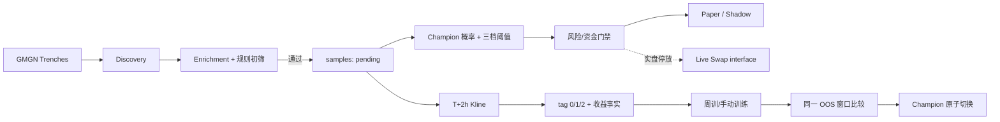

# 开发文档

> 项目：Solana Meme Quant Trading System  
> 工作目录：`D:\meme`  
> 文档基线：2026-08-10，时区 `Asia/Shanghai`  
> 技术栈：FastAPI + Python 3.11+ + SQLite + scikit-learn/XGBoost + React/Vite/TypeScript  
> 安全声明：本文只描述配置键名和协议，不包含任何 `.env` 值、API Key、私钥、签名原文或序列化交易。

## 1. 规范优先级

发生冲突时，按以下顺序处理：

1. 用户最后明确确认的业务规则；
2. `README.md` 的冻结业务口径；
3. 本文的工程和外部 API 约束；
4. `architecture_review.md` 的架构门禁与风险说明；
5. `量化训练采集.py` 仅作为旧采集实现参考；
6. `meme数据.csv` 仅是历史事实，不能反向定义新规则。

未经业务确认，不得把标签、止盈止损、持仓上限、资金公式、模型晋级、Launchpad 范围、手续费上限或实盘权限作为“技术优化”修改。必要变更应先写 ADR，说明动机、兼容性、数据迁移、回滚和测试。

## 2. 当前实现概览

### 2.1 运行拓扑

```text
React/Vite :5173
       │ /api proxy
       ▼
FastAPI :8000
  ├─ SQLite repository / runtime state / audit
  ├─ Collector / monitor-only worker ── GMGN data + 1m Kline
  ├─ Durable TrainingWorker + weekly scheduler + model health
  ├─ Prediction + PaperPositionMonitor + simulation session ledger
  ├─ Agent read context + human-approved non-live proposals
  └─ Live execution core (parked) ── gmgn-cli / GMGN provider contracts

本地持久化：data/meme_quant.db
模型工件：ml_models/*.joblib
```

后端生命周期会初始化/迁移 SQLite、幂等导入根目录 CSV、先恢复中断的训练任务与未决 live journal，再启动持久训练队列、周训练调度、7 日模型健康、prediction、模拟 K 线退出、标签补齐、reconciliation 和 liquidation。当前第一版仍按单个 FastAPI 应用进程部署；训练任务、模拟会话和审批提案虽然已经持久化，但跨进程/多服务器调度仍属于后续 PostgreSQL/lease 扩展范围。

### 2.2 实际代码地图

| 路径 | 职责 |
| --- | --- |
| `backend/app/main.py` | FastAPI 应用、CORS、生命周期、后台 worker 启停。 |
| `backend/app/config.py` | 从根目录 `.env` 加载非秘密运行配置；校验费用/滑点阶梯。 |
| `backend/app/database.py` | SQLite 连接、WAL、事务、schema、runtime state、审计。 |
| `backend/app/api/` | `/api` 路由和 Pydantic 请求 schema；路由不应复制领域规则。 |
| `backend/app/collector/` | discovery、enrichment、本地过滤、K 线标签、限流与外部 DTO。 |
| `backend/app/services/collector_worker.py` | 12 Key 角色装配；完整采集或 monitor-only 模式；模拟退出/标签/发现故障隔离；三生命周期独立统计与最近 250 条结构化实时事件缓冲。 |
| `backend/app/ml/` | 无泄漏特征、可选 feature schema、时序切分、五候选、收益、阈值、模型工件和晋级。 |
| `backend/app/services/training.py` | 持久化训练任务、模型注册、incumbent recipe 重建、同窗口晋级比较、回滚。 |
| `backend/app/services/training_worker.py` | 串行消费 durable training queue；进程中断恢复与有限重试。 |
| `backend/app/services/model_health.py` | 7 日成熟 OOS 健康评估；真实 USD 可比时触发 degraded 重训。 |
| `backend/app/scheduler/service.py` | 周日 03:00、启动补跑、计划点幂等与失败有限重试。 |
| `backend/app/trading/simulator/` | 纯本地、可注入、可复现的成交/滑点/费用/失败模拟器。 |
| `backend/app/services/paper_trading.py` | SQLite paper/shadow 账户、simulation session、仓位/交易/PnL 账本。 |
| `backend/app/services/paper_position_monitor.py` | 1m K 线 first-touch 退出、同币请求合并、closing 重启续跑。 |
| `backend/app/services/agent_service.py` | 只读上下文 + 人工审批后的非实盘白名单动作；无 live 执行权限。 |
| `backend/app/trading/live/` | transport-neutral Swap 类型、provider、状态机、错误分类。 |
| `backend/app/services/order_journal.py` | SQLite 幂等订单 journal。 |
| `backend/app/services/live_trading.py` | DRY RUN/二次确认门禁、gmgn-cli 适配和执行阶梯。 |
| `backend/app/risk/service.py` | 单笔本金、10 仓、同币、SOL 储备、日损、连续亏损门禁。 |
| `backend/app/services/runtime.py` | 实盘/清仓一次性挑战、运行状态、暂停新开仓。 |
| `frontend/src/pages/` | Dashboard、Model Center、Signals、Portfolio/会话历史、Runtime Monitor、Agent Approval。 |
| `tests/` | 标签、过滤、限流、ML 时序、模拟、实盘 mock、数据库、风控和 runtime。 |

依赖约束：

- 外部 GMGN 响应必须先转为内部 DTO；业务服务不得直接依赖未经验证的原始字段。
- `trading/live` 是唯一允许签名/广播的位置；模拟器不得加载钱包私钥。
- `.env` 值不得进入前端 bundle、数据库业务字段、异常响应或测试快照。
- 所有时间以 UTC 持久化，页面按 `Asia/Shanghai` 展示。

## 3. 数据流与状态

### 3.1 主流程



模型拒绝、风控拒绝、报价失败或实盘失败都不能阻止样本在 T+2h 补标签。所有通过初筛的样本都应保留，以免只训练“曾经交易”的选择偏差数据。

### 3.2 样本与标签

- 样本唯一键：SHA-256(`chain|address|entry_time`)；同地址跨策略窗口可重复。
- 新标签版本：0.9x 止损、1.6x 止盈、2h 超时收盘严格大于 1.2x 为 `tag=2`。
- 同一 1m K 线 TP/SL 同时触发时，`first_sl <= first_tp`，止损优先。
- 历史 CSV 的 16 条非 TP 正类迁移为 legacy `tag=2`，收益只按已知 `+25%` 下限估算。
- 新数据必须保存真实 `liquidity` 和 `final_close_ratio`；旧数据缺失时 `utility_eligible=false`。

当前 `samples` 已持久化完整标签路径事实：`first_take_profit_at`、`first_stop_loss_at`、`exit_reason`、`same_bar_conflict`、`gross_return_rate`、`return_source`。legacy 行通过幂等 migration 回填 `legacy_label_rule/legacy_floor` 来源；新样本由 1m K 线写入真实 first-touch 路径。`price_change_1h/5m` 在准入时优先读取快照，缺失时立即使用 `T-1h → T` K 线回补，T+2h finalizer 只做补漏，不允许未来 K 线泄漏进入准入评分。

## 4. SQLite 数据库

SQLite 启用：

```text
PRAGMA foreign_keys = ON
PRAGMA journal_mode = WAL
PRAGMA synchronous = NORMAL
PRAGMA busy_timeout = 30000
```

当前 schema 版本为 **6**，`Database.initialize()` 对旧库做幂等 migration；真实 `data/meme_quant.db` 已从 legacy 状态升级到 v6。主要表如下：

| 表 | 关键字段/约束 | 说明 |
| --- | --- | --- |
| `schema_meta` | `key` PK，`value` | 当前 schema 版本。 |
| `samples` | `sample_key` UNIQUE；`tag in (0,1,2)`；first-touch/return source | 入场快照、features JSON、标签路径和 legacy 资格。 |
| `models` | `version` UNIQUE；最多一个 champion；candidate/rejected/retired | recipe、阈值、指标、工件、训练窗口和回滚链。 |
| `predictions` | UNIQUE(`sample_id`,`model_id`,`profile`) | 概率、阈值快照、是否入选。 |
| `simulation_sessions` | 最多一个 `active` | 固定模拟会话及历史 session registry。 |
| `positions` | `simulation_session_id`；账户/档位/状态/PnL；live open token 唯一 | 当前/历史模拟与 live 分账。 |
| `trades` | `client_order_id` UNIQUE；intent fingerprint；journal state | 模拟成交或 live quote/submit/status；失败分类与脱敏响应。 |
| `training_runs` | request JSON、`scheduled_for`、retry、model/promoted/summary | durable manual/weekly/startup/degraded queue。 |
| `agent_proposals` | pending/approved/rejected/executed/failed | Agent 人工审批、结果和错误审计；只允许非实盘动作。 |
| `runtime_state` | `key` PK，JSON | worker 状态、风险暂停、当前模拟 session 指针等。 |
| `audit_logs` | 时间、严重度、分类、动作、实体、details JSON | 模式切换、训练、风控、提案和交易审计。 |

### 4.1 事务与约束

- 所有写操作应使用短事务；开仓与订单幂等检查使用 `BEGIN IMMEDIATE`。
- 实盘同 Token 的 `opening/open/closing` 通过部分唯一索引作第二道防线。
- 一个 Champion 通过部分唯一索引保证；晋级在同一事务内退役旧模型并激活候选。
- 订单先 reserve 到 `trades`，再调用外部 provider；禁止先广播后记账。
- 当前金额字段使用 SQLite `REAL`。在多币种/大资金生产化之前，应通过版本化迁移改为微美元整数、lamports 和 token 原子单位；不得在无迁移的情况下直接改列语义。

### 4.2 备份与恢复

备份必须同时覆盖：

- `data/meme_quant.db`（使用 SQLite backup API 或停写后复制，包含 WAL 时不能只复制主文件）；
- 当前 Champion 对应的 `ml_models/*.joblib`；
- 脱敏后的运行配置清单，不包含 `.env`；
- 必要时保留原始 `meme数据.csv`，但交付 ZIP 和 Git 默认排除。

恢复后先校验数据库完整性、Champion 工件可加载、未决 `trades` 与钱包余额，再允许新开仓。

## 5. FastAPI 接口（当前实现）

当前统一前缀为 `/api`，不是 `/api/v1`。

| 方法 | 路径 | 作用 |
| --- | --- | --- |
| GET | `/health` | 进程存活与环境摘要。 |
| GET | `/api/dashboard` | 数据集、Champion、PnL、信号、Runtime、风控汇总。 |
| GET | `/api/models` | Champion、模型版本、feature catalog/coverage 与最近 durable training runs。 |
| POST | `/api/models/train` | 按可选 feature schema 创建手动训练队列项，返回 `run_id`；HTTP 不直接执行训练。 |
| GET | `/api/models/training-runs` | 训练任务、retry、计划点与晋级摘要。 |
| POST | `/api/models/{model_id}/rollback` | 仅将工件可加载的 `retired` 历史 Champion 原子恢复。 |
| GET | `/api/signals` | 最新三档预测/选择记录。 |
| GET | `/api/portfolio` | 兼容接口：默认返回当前 simulation session + live；可显式包含旧模拟 session。 |
| GET | `/api/portfolio/view` | 持仓页专用视图；按 `mode=simulation|live`、`profile` 返回当前仓位和 SQL 真分页交易历史，支持 `page/page_size/start_at/end_at`；当前仓位透出监控周期缓存的流动性/市值市场快照。 |
| GET | `/api/simulation` | 当前模拟 session 与三账户账本。 |
| POST | `/api/simulation/reset` | 无模拟持仓时关闭旧 session 并创建新的 `1000 USD + 0.1 SOL` 三账户会话。 |
| GET | `/api/simulation/history` | 兼容的模拟 session registry 与账户汇总。 |
| GET | `/api/simulation/audit` | 将每个 simulation session 展平为平衡/激进/保守三条独立交易审计，不合并三档 PnL。 |
| GET | `/api/runtime` | Runtime、TrainingWorker、model health、Collector 周期状态与风险门禁。 |
| GET | `/api/runtime/collector-events` | 最近 1–250 条 Collector 结构化实时事件；供本地 Runtime 终端轮询展示，不包含 API Key/私钥/完整 Token 地址。 |
| POST | `/api/runtime/live/prepare` | 生成短期、一次性实盘确认 challenge。 |
| POST | `/api/runtime/live/confirm` | 第二次点击确认，消费 challenge。 |
| POST | `/api/runtime/live/stop` | 停止实盘新开仓。 |
| POST | `/api/risk/resume` | 人工恢复新开仓；调用前必须核对根因。 |
| POST | `/api/portfolio/liquidate/prepare` | 生成一键清仓预览/challenge。 |
| POST | `/api/portfolio/liquidate/confirm` | 冻结清仓仓位快照、暂停新开仓、关闭普通 live 执行并持久化 queued job。 |
| GET | `/api/agent/context` | 只读导出运行态、风控、Champion、持仓、信号、允许/永久禁止动作和审计摘要。 |
| POST | `/api/agent/proposals` | 仅允许 `train_model/rollback_model/reset_simulation/pause_new_entries/resume_new_entries`，创建 `pending_approval`；live 类提案 422 拒绝。 |
| GET | `/api/agent/proposals` | 查询持久化 Agent 提案、人工决策和执行结果。 |
| POST | `/api/agent/proposals/{id}/approve` | 人工批准后执行白名单非实盘动作并审计。 |
| POST | `/api/agent/proposals/{id}/reject` | 人工驳回，不产生任何动作。 |
| POST | `/api/data/import` | 幂等导入根目录 `meme数据.csv`。 |

变更接口的当前 challenge/幂等保护应继续增强：生产部署需加身份认证、CSRF/Origin 控制、角色权限和 correlation id。单用户本地版不能被直接暴露到公网。

## 6. 配置与秘密

### 6.1 配置加载

`Settings` 从根目录 `.env` 读取。已有 `.env` 是本地事实源，不要要求用户重复提供 GMGN Key，也不要用 `.env.example` 覆盖它。常用非秘密键：

```text
APP_ENV, APP_HOST, APP_PORT, FRONTEND_ORIGIN, SQLITE_PATH
DRY_RUN, SIMULATION_ENABLED, TRADING_PROVIDER, GMGN_CLI_PATH
WALLET_PUBLIC_KEY
LIVE_CONFIRMATION_TTL_SECONDS
WALLET_SOL_RESERVE, MAX_OPEN_POSITIONS
MAX_DAILY_LOSS_FRACTION, CONSECUTIVE_LOSS_LIMIT
TRAINING_TIMEZONE, TRAINING_WEEKDAY, TRAINING_HOUR, TRAINING_MINUTE
TRAINING_LOOKBACK_DAYS, TRAINING_HOLDOUT_DAYS
MIN_PRECISION, PROMOTION_MIN_PNL_LIFT
COLLECTOR_ENABLED, COLLECTOR_POLL_SECONDS, GMGN_TRENCHES_LIMIT
```

采集器按 `GMGN_API_KEY_1`…`GMGN_API_KEY_12` 装配槽位，并读取 `GMGN_API_BASE_URL` 及可选 endpoint path。实盘签名/钱包秘密只允许在 live provider 进程读取；不得打印配置对象或 `dotenv_values()` 的内容。

### 6.2 Git/日志/前端安全

必须排除：

```text
.env, .venv, *.db, *.db-wal, *.db-shm
*.joblib, *.pkl, node_modules, frontend/dist
logs/*, meme数据.csv, 钱包文件, 私钥文件, 交付 ZIP
```

日志只允许记录 API 槽位编号、endpoint、状态、权重、reset 时间、order id、脱敏钱包和稳定错误码；禁止记录 header、Key、私钥、完整签名、原始序列化交易和未脱敏 provider 响应。

## 7. 采集系统

### 7.1 外部适配器

`GMGNDataClient` 注入 transport 和共享 limiter；默认 endpoint：

```text
/v1/trenches
/v1/token/info
/v1/token/security
/v1/token/pool_info
/v1/market/token_top_holders
/v1/market/token_kline
/v1/market/rank
/v1/user/created_tokens
```

这些路径是当前适配器契约，不代表 GMGN 永久稳定。上线前必须用当前账号权限做只读 contract test，并保留脱敏 fixture；若官方字段变化，应只修改 adapter 和 DTO，不把兼容分支散落到领域服务。

### 7.2 限流

采集器同时应用：

- 全局安全门限 2 requests/second；
- endpoint 权重：top holders=5、trenches=3、Kline/created tokens=2、其他=1；
- 429 时优先解析 `X-RateLimit-Reset`、`Retry-After` 或响应体 `reset_at`；
- 未提供 reset 时默认冷却 5 分钟，再附加 15 秒缓冲；
- 冷却期间所有槽位停止请求，不能不断探测以免延长封禁。

注意：当前 limiter 是进程内共享对象，不是跨进程持久化协调器。因此采集器只应启动一个实例；多进程部署前必须把全局 IP 冷却状态迁移到共享存储。

### 7.3 429 与 Cloudflare 排障

先区分：

1. JSON/HTTP `429`：读取 reset 时间，立即停止所有槽位请求；冷却结束后再恢复。
2. Cloudflare HTML block：不是普通业务 429。立即停止外呼，检查是否存在多个进程/旧脚本/代理同时请求；等待平台解除后，以更低速率单实例恢复。

不要把“有 12 个 Key”理解成可把同一 IP 速率乘 12。不要在冷却期通过健康检查反复请求 GMGN；ready 状态可以标记 degraded，但不能让进程管理器无限重启制造更多请求。

## 8. 机器学习

### 8.1 特征泄漏防线

`FeatureBuilder` 会：

- 解析秒、毫秒或 ISO 时间并按 UTC 稳定排序；
- 只保留成熟 `tag in {0,1,2}`；
- 把 `tag in {1,2}` 映射为正类；
- 生产训练使用显式 allowlist，排除 identity、`launchpad`、未来 2h 字段、退出/收益/交易结果和地址/交易哈希模式；
- `price` 是 admission-time `samples.entry_price`，允许进入默认 recipe；`ln(liquidity_usd)` 同样是入场时已知但因 legacy 覆盖率为 0，当前只采集并作为可选特征，默认关闭；
- 对数值列做中位数补缺，对类别列做常量补缺与未知类别安全编码；
- 将特征列顺序和预处理器封装到同一 sklearn Pipeline；每个 `training_run` 持久化实际 feature schema，线上 prediction 从相同字段重建输入。

任何新增字段默认应先按“不可信”处理。只有证明它在 `entry_time` 时已知，且新增泄漏测试后，才允许进入 feature schema。尤其不要把 `price_2h_max_ratio`、`price_2h_min_ratio`、`final_close_ratio`、标签路径、模拟/实盘结果用作特征。

### 8.2 时间切分与候选

`TemporalSplitter` 使用确定性扩展窗口，所有边界保留 2 小时 gap：

- `<120` 天：全量按时间排序，最后 20% 最终留出；
- `>=120` 天：最近 120 天，最近 30 天最终留出；
- 开发期默认 3 个扩展窗口 fold；
- 最小训练 40 行、最小测试 10 行；数据或单类不足会显式失败。

五候选均使用固定随机种子。XGBoost 不可用时会记录 skipped，不应导致其余四模型静默失败；当前项目 `.venv` 已安装 XGBoost 3.4.0，真实训练 run `0e4a4cd7-d933-45f3-8c1b-3662a566d21e` 已验证 XGBoost=`ok`，即五候选均实际执行。候选必须同时通过开发期和最终留出的 20% Precision 门槛与最低交易数。

### 8.3 收益、阈值和奥卡姆选择

真实效用：

```text
capital = min(0.01 × real_entry_liquidity, 50)
return(tag1) = +0.60
return(tag2) = final_close_ratio - 1
return(tag0) = -0.10
```

旧数据缺真实 liquidity 时只生成 legacy proxy；指标字段明确区分 `cumulative_pnl_usd` 与 `proxy_pnl`。`utility_eligible=false` 时自动晋级必须被阻止。

三档阈值从开发期 OOS 概率搜索：激进优先 Recall，平衡优先累计效用和稳定性，保守优先 Precision/回撤，并强制顺序。若没有阈值同时满足 Precision 和最低交易数，训练失败，而不是降低业务门槛。

最终 recipe 选择结合开发/最终留出得分，并设置 2% 等价区间；近似等价时按 complexity rank 选择更简单模型。生产 bundle 在 active 窗口 refit；另存 pre-holdout evaluation bundle 用于公平晋级比较。

### 8.4 Champion 晋级

同一时间外窗口同时评估候选和 incumbent，不能把 incumbent 的真实交易收益与候选 paper 回测混比。自动晋级 blockers 包括：

- 评价行缺真实 liquidity；
- `tag=2` 收益为估算；
- 候选 Precision <20%；
- 候选交易数过少；
- 比较模型不是 pre-holdout evaluation bundle；
- 模型训练时间与比较窗口重叠；
- PnL 未达到 5% normalized lift。

第一模型可作为 bootstrap Champion 供模拟/影子验证，但这不等于已经证明真实美元收益优势。已有 Champion 后，不再加载其“全量 refit production bundle”硬比；系统会按 incumbent 原 algorithm + feature schema 在当前 pre-holdout 历史上重建 evaluation bundle，再与 Challenger 在完全相同 final OOS rows 比较。这样 incumbent 即使最近已退化、跌破候选门槛，也仍能作为基线被公平比较。真实 2319 条库已完成两轮训练验证：首轮 Logistic Regression bootstrap，第二轮 incumbent rebuild 成功、因 legacy 经济口径不可比而安全拒绝 Challenger。

### 8.5 调度和退化监控

周训：每周日 03:00（Asia/Shanghai）。每个计划点持久化唯一 `scheduled_for`，同一周计划不会重复创建；关机错过时启动后排入 `startup_catchup`。计划失败只在同一个 run 上有限重试。手动/周训/startup/degraded 均只创建 durable queue item，由唯一 `TrainingWorker` 串行执行；进程重启时旧 `running` 会在 retry budget 内重新入队，超限则明确 failed，不会永久占锁。

7 日 `ModelHealthService` 已完整接入：只统计当前 Champion 的 balanced 档成熟 OOS prediction；样本量和交易数不足时仅报告；recent window 只要混有 legacy/估算经济事实，就禁止自动退化决策。仅当 recent 与 Champion baseline 都是可比较的真实 USD 口径时，Precision 跌破 20% 或 recent ROI 低于基线的配置比例（默认 70%）才创建 `degraded` training run，并有 24 小时冷却。新模型仍必须通过共享 OOS + 5% lift 晋级门禁；失败时标记 `rejected`，不会误换 Champion。历史 `retired` Champion 的工件可加载时可人工原子回滚。

## 9. 模拟、影子与实盘

### 9.1 模拟器

固定模拟由纯函数 `TradingSimulator` 与 SQLite `PaperTradingService`/`PaperPositionMonitor` 两层组成：

- 每个 simulation session 创建 `paper`、`shadow_aggressive`、`shadow_conservative` 三个独立账户，各初始化 `1000 USD + 0.1 SOL`；session 进入 `simulation_sessions` registry，reset 只关闭旧 session/创建新 session，不删除历史仓位、成交和 PnL；
- 单笔 `min(1% liquidity, $50)`，每账户最大 10 仓，同 Token 多批次独立；
- BUY/SELL 均经过 seeded quote model，包含流动性占比价格影响、随机滑点、1% 平台费、网络费、延迟和可注入失败；失败不会伪造仓位/平仓；
- `PaperPositionMonitor` 使用 GMGN 1m K 线判断 first-touch：0.9x 止损、1.6x 止盈、2h 到期，同 bar 止损优先；同 Token 多仓合并一次 K 线请求；
- 一旦触发退出，reason/reference/trigger time 写入 `paper_exit_pending` 并进入 `closing`；SELL quote 失败时后续周期/进程重启只重试原退出，不因后来价格改写原因；
- prediction 不再用成熟 `tag` 事后“替模拟盘成交”。理论标签收益与 executable simulation PnL 完全分离；
- `COLLECTOR_ENABLED=false` 但 `PAPER_MARKET_MONITOR_ENABLED=true` 时运行 monitor-only worker，已有模拟仓位退出和 T+2h label finalization 不依赖 discovery 是否开启。

本地 quote 模型不是 GMGN 真实报价，因此模拟 PnL 只代表受控执行模型，不冒充链上真实收益。影子账户仍属于模拟账本；真实钱包资金同步留到实盘阶段。

### 9.2 实盘启用

默认 `DRY_RUN=true`。本轮按用户要求只保留实盘接口，不实现自动 live BUY；未来实盘固定使用 README 的 `balanced` profile。实盘准备接口会检查：

- DRY RUN 已关闭；
- `WALLET_PUBLIC_KEY` 存在；
- provider 未禁用；
- 不存在尚未完成启动对账的未决/未知订单；
- 风险摘要可展示。

后端生成短期 challenge，只保存 hash 和过期时间；前端弹窗完成第二次点击后消费 challenge。重复、过期或错误 challenge 均拒绝。当前单机实现的 challenge 尚未绑定登录身份/会话；公网化前必须补鉴权和会话绑定。

### 9.3 订单状态机与幂等

```text
intent_created
  → quoting
  → submission_started ──进程崩溃/submit 异常且无 order_id──→ submission_unknown
  → submitted
  → pending / processed ──只轮询原订单──┐
  → confirmed                           │
  → failed / expired ──满足明确原因才升级┘
  → submission_unknown ──必须先对账，禁止重发

legacy reserved（旧版本）──无 order_id──→ submission_unknown
```

`client_order_id` 绑定 SwapIntent 指纹；相同 id 但不同钱包/token/金额/side 会抛 `IDEMPOTENCY_CONFLICT`。新 journal 在 quote 前写 `quoting`，真正调用 submit 前先持久化 `submission_started`：因此启动时 `intent_created/quoting` 可以安全终止，而 `submission_started`、legacy `reserved` 以及任何 submit 阶段异常都必须视为外部可能已接单并转为 `submission_unknown`。只有拿到稳定 `provider_order_id` 才查询原单；不能仅凭异常类型推断“肯定未成交”后重发。

允许自动提高费用/滑点的明确 terminal code 仅包括：

```text
BLOCKHASH_EXPIRED
TRANSACTION_EXPIRED
PRIORITY_FEE_TOO_LOW
TIP_TOO_LOW
SLIPPAGE_EXCEEDED
TX_DROPPED
```

### 9.4 错误分类矩阵

| 类型 | 是否升级费用/滑点 | 处理 |
| --- | --- | --- |
| 提交前网络/DNS/超时 | 否 | 同档指数退避，保留 intent。 |
| 提交后超时/结果未知 | 否 | `submission_unknown`；查询原单/余额，禁止重发。 |
| HTTP 429/限流 | 否 | 全局暂停到 `reset_at` 后，不探测。 |
| API 5xx | 否 | 同档重试只限读操作；提交阶段先对账。 |
| 鉴权/签名/参数错误 | 否 | 停止 intent、暂停实盘新买入、告警。 |
| 余额不足/低于 0.1 SOL 储备 | 否 | 刷新余额，风控拒绝。 |
| 无 route/流动性不足 | 否 | 买入到期放弃；卖出进入受阻/人工介入。 |
| pending/processed | 否 | 只轮询原订单。 |
| 明确 expired/dropped/费用不足 | 可以 | 确认未成交后使用下一受控档。 |
| confirmed | 不适用 | 只记一次成交，停止重试。 |

### 9.5 执行阶梯

默认 low/medium/high 滑点为 10%/15%/25%，priority fee 为 0.002/0.003/0.005 SOL，tip 为 0.0001/0.0005/0.001 SOL；每档 `priority+tip <= 0.006 SOL`。配置校验强制单调且不超过硬上限。

买入：low×3 → medium×2 → high×1。卖出：low×3 → medium×2 → high×2；达到上限仍失败必须进入人工介入，不能无限提高。

这不是实时费用分位策略。后续接入官方/可信费用分位源时，必须先定义“分位越高费用越高”的方向、数据新鲜度和 fallback；用户冻结的最大 25% 滑点与 0.006 SOL 上限仍然有效。

### 9.6 一键清仓

当前 API 通过 challenge 确认后会立即暂停新开仓、关闭普通 `live_trading_enabled`，冻结 `position_ids` 快照并持久化稳定 `liquidation_job.id`。`LiquidationWorker` 已接入应用生命周期，按 `queued/running` 恢复：paper/shadow 只有取得新鲜市场参考并成功生成模拟 SELL quote 后才关闭；live 使用稳定 `client_order_id={job_id}:{position_id}:sell` 串行退出，只有 `CONFIRMED` 才关闭仓位，`PENDING/UNKNOWN` 继续轮询原订单，缺少原子数量或退出币种时明确 BLOCKED。完成/受阻结果逐仓持久化并生成汇总报告；清仓结束后新开仓仍保持暂停，需人工恢复并重新走实盘二次确认。

## 10. GMGN 合约调通

### 10.1 已参考的官方/一方资料

- GMGN Solana Trading API 流程：route/transaction → 签名/提交 → status：  
  https://docs.gmgn.ai/index/cooperation-api-integrate-gmgn-solana-trading-api
- GMGN Data crawling 2 requests/second 说明：  
  https://docs.gmgn.ai/index/cooperation-api-data-crawling-ip-whitelist
- GMGNAI 官方仓库当前 trade/market/token skills 与 v1 endpoint 示例：  
  https://github.com/GMGNAI/gmgn-skills
- GMGN 交易失败/费用说明：  
  https://docs.gmgn.ai/cn/jiao-yi-gua-dan-shi-bai-yuan-yin  
  https://docs.gmgn.ai/cn/gmgn-shou-xu-fei-he-chang-jian-fei-yong-she-zhi

官方文档和 CLI 可能不同步，且账号权限、endpoint、字段、签名方式可能变化。仓库代码中的路径和参数必须通过部署环境的 contract test 证明，不得因“文档看起来一致”直接实盘。

### 10.2 调通顺序

1. 记录 `gmgn-cli --version` 和 help 输出结构，只记录版本/参数名，不记录秘密。
2. 用当前 `.env` 的现有凭据做只读 health/quote；不得要求用户重复粘贴 Key。
3. 保存脱敏 quote fixture，核对 amount 原子单位、token decimals、min output、slippage 的单位。
4. 用 mock 覆盖 `pending/processed/confirmed/failed/expired`、429/reset、5xx、无 route、签名错误。
5. 验证 order query 的稳定标识是 `order_id`、tx hash 还是两者，并保证重启可查询。
6. 验证钱包余额、SOL/USD 估值、投入美元到 base token 原子数量的转换与四舍五入。
7. 经用户明确授权后，使用极小金额做一次 buy/sell contract test；每一步观察 DB journal 与链上结果，禁止并发。
8. 只有实盘门禁矩阵全部通过，才允许常驻自动执行。

2026-08-10 已新增 `tests/fixtures/gmgn_contracts.json` 与 fixture contract tests，锁定当前 adapter 对 Quote/Swap/Query、`pending/processed/success/expired/failed`、429 reset、5xx、422 和 slippage exceeded 的解析行为；这些测试不访问 GMGN、不签名、不广播，不能替代上述现场步骤 1-3、5-7。

### 10.3 现场必须确认的契约

- `gmgn-cli` 当前是否仍支持 `quote`、`swap`、`order get --raw` 及代码使用的参数名；
- HTTP provider 的 `/v1/trade/quote`、`/v1/trade/swap`、`/v1/trade/query_order` 鉴权/签名要求；
- 状态枚举和成功码；
- 交易过期时长、blockhash/anti-MEV 行为；
- priority fee 与 tip 的单位是 SOL 还是 lamports；
- GMGN 1% 产品费适用范围和响应字段；
- 429 reset 的秒/毫秒单位；
- quote_address/base token、USDC/SOL 资金口径、token decimals；
- pending 后重复 query 的推荐间隔和最终状态一致性。

## 11. 前端

React 19 + TypeScript + Vite。左侧产品导航顺序固定为：`总览 → 持仓 → 样本采集 → 运行监控 → 模型中心 → Agent审批`。路由仍保持兼容：

- `/`：数据集、当前 simulation session 的已实现损益、Champion、信号和 worker 总览；
- `/portfolio`：持仓主工作台。页面先在 `simulation/live` 两种模式间切换，再点击平衡/激进/保守档位过滤当前持仓与交易历史；只跑模拟时默认 simulation，live 已启用时默认 live。右上角原时区文本位置显示模式切换按钮。当前持仓展示缓存的当前流动性/市值与 Token 悬浮复制；交易历史使用后端真分页、默认 30 行、localStorage 记忆 page size、页码跳转与退出时间范围筛选；交易审计按三档独立列示。live 模式使用同构 UI 和 `account_kind='live'` 持久账本，接口契约指向 GMGN Trading API，但不伪造钱包余额，也不代表自动 live BUY 已接通；
- `/signals`：产品名称“样本采集”，展示概率/阈值/入选/成熟标签/模型版本；
- `/runtime`：TrainingWorker、collector/monitor-only、model health、scheduler、reconciliation/liquidation 和实盘两步接口状态；
- `/models`：Champion、EARLY/效用资格、三阈值、feature coverage/自选特征、durable training runs、版本拒绝与回滚；
- `/agent`：Agent 白名单/永久禁止项、持久化提案、人工批准/驳回和执行结果。页面不存在 live Agent 执行按钮。

页面只显示后端返回的事实，不生成假数据。关键风险状态除颜色外还必须有文字；秘密字段不应出现在 TypeScript 类型或响应 schema。

## 12. 安装、启动与部署

### 12.1 Windows 本地开发

```powershell
Set-Location D:\meme
.\.venv\Scripts\python.exe -m pip install -r requirements.txt

Set-Location D:\meme\frontend
npm install
```

后端（本地开发热更新）：

```powershell
Set-Location D:\meme
.\.venv\Scripts\python.exe scripts\start_runtime.py --reload
```

`start_runtime.py` 只在显式 `--reload` 时追加 Uvicorn reload，并将监控目录限定为 `backend/`；PID 写入 `logs/backend.pid`。普通常驻启动去掉 `--reload`。

前端：

```powershell
Set-Location D:\meme\frontend
npm run dev
```

不要把后端热重载用于实盘常驻；reload 会重启进程并可能重复启动非持久化 worker。

### 12.2 单机生产建议

- `APP_ENV=production`，但上线初期仍保持 `DRY_RUN=true`；
- 后端只运行一个 Uvicorn worker；
- 前端 `npm run build` 后由受控静态服务器托管；
- FastAPI 仅监听内网/localhost，通过 TLS 反向代理和身份认证访问；
- 使用 Windows Task Scheduler/NSSM/systemd equivalent 管理进程；
- 配置数据库与模型工件备份，日志轮转和磁盘告警；
- 进程启动会先运行订单 journal 对账，再启动采集/预测/训练 worker；有 `provider_order_id` 时只查询原订单，无法确认的 submit 保持 `submission_unknown` 并暂停新开仓。无 order_id 的钱包/代币余额对账尚未实现，因此该场景继续 fail-closed。

服务器迁移 PostgreSQL 前，不要简单把 SQLite 文件放网络共享盘，也不要增加多个采集进程。

## 13. 测试与质量门禁

### 13.1 命令

```powershell
Set-Location D:\meme
.\.venv\Scripts\python.exe -m pytest

Set-Location D:\meme\frontend
npm run build
```

可选静态检查（依赖安装后）：

```powershell
Set-Location D:\meme
.\.venv\Scripts\python.exe -m ruff check backend tests
```

### 13.2 必测矩阵

- 标签：SL 先、TP 先、同 bar、close 等于/略高/略低 1.2、窗口边界、first-touch/return source 落库；
- CSV：2319 行、2 pending、16 legacy tag2、重复导入、同地址不同时间、schema migration 后数量不漂移；
- 特征：显式 allowlist、`price` admission-time、`ln(liquidity_usd)` 可选/默认关闭、未来列排除、1h/5m 截止入场、缺失/列顺序；
- 采集生命周期：monitor-only 不调用 discovery，但继续 paper exit 和 T+2h finalization；
- 时序：不足/达到 120 天、最后 20%/30 天、2h gap、无随机切分；
- 五模型：固定种子、XGBoost 缺失、Precision/交易数门槛、奥卡姆等价选择；
- 晋级/回滚：incumbent recipe 重建、同 OOS rows、缺 liquidity/估算 tag2、5% lift、rejected/retired 语义、工件可加载回滚；
- 训练生命周期：feature request 持久化、周日 03:00 计划点唯一、有限 retry、TrainingWorker 串行消费、进程中断恢复、7 日真实 USD 退化监控；
- 模拟：三账户同 session、账本事务、费用/滑点/延迟/失败、10 仓、同币多批次、1m first-touch、closing 失败重试/重启恢复、session reset/history 隔离；
- 实盘 mock：quote/submit/query、`intent_created -> quoting -> submission_started -> submitted` journal 崩溃窗口、pending/unknown 不重发、submit 阶段 429 后禁止重发、expired、confirmed；
- 启动对账：新 pre-submit 状态可安全取消，legacy `reserved` / `submission_started` fail-closed，有 order id 只查询原单；
- Runtime/清仓：challenge 过期/重放/错误、固定仓位快照、paper SELL quote、live pending 恢复同一 order id、缺原子金额不假关仓；
- Agent：只读 context、unsafe live proposal 创建即拒绝、安全 proposal 人工 approve/reject 后才执行、无直接 execute/liquidate API；
- API：模型 durable queue、simulation status/history、Agent 审批均有 FastAPI route smoke test；
- 前端：Dashboard/Models/Signals/Portfolio/Runtime/Agent 六页面 production build、错误/空状态、确认弹窗、无秘密；
- 交付：Git/ZIP（若存在）不得包含 `.env`、数据库、日志、模型、CSV、node_modules 或秘密。

测试默认不得真实访问 GMGN 或广播交易。

## 14. 常见问题

### 14.1 Collector 显示 blocked

检查：

- `.env` 是否存在 12 个非空 `GMGN_API_KEY_n`；
- `GMGN_API_BASE_URL` 是否为当前账号可用地址；
- endpoint path 是否与当前 API 契约一致；
- 是否同时运行旧采集脚本或另一个后端实例；
- 日志只查看脱敏错误，不打印配置值。

### 14.2 429 持续延长

停止所有实例，读取 `reset_at`，在该时间之后再恢复；不要通过重启或 health probe 继续外呼。确认全局 limiter 只有一个实例，排查旧脚本和其他机器是否共用同一 IP。

### 14.3 初始训练无法自动晋级

旧 CSV 缺真实 liquidity 和精确 `tag=2` close，系统会输出 proxy utility 并阻止自动 5% PnL 晋级。这是预期保护。继续采集具备真实字段的新样本，直到同一最终比较窗口全部 `utility_eligible=true`。

### 14.4 训练提示无可用阈值/候选

常见原因：时间窗口正类太少、2 小时 gap 后训练行不足、候选在开发或最终留出 Precision 低于 20%、最低交易数未达标。不得改为随机切分或降低门槛；应检查数据质量、标签版本和时间覆盖。

### 14.5 实盘按钮不可确认

常见 blocker：`DRY_RUN=true`、缺 `WALLET_PUBLIC_KEY`、provider disabled、存在未决/未知订单需要启动对账。清仓确认后普通 `live_trading_enabled` 会被主动关闭；要恢复新 BUY，必须先解除风险暂停并重新完成实盘二次确认。即使按钮可确认，也只代表运行门禁被 arm，不代表真实 GMGN contract、钱包余额和自动下单链路已经验收。

### 14.6 gmgn-cli 参数/JSON 变化

记录 CLI 版本与 `--help`，用脱敏 fixture 更新 adapter 和 tests。不要为了“先跑通”把私钥放命令行、日志或源码；不要在解析失败时退化为假成功。

### 14.7 SQLite locked

确认只有单个后台应用实例；缩短写事务，不在事务中等待网络；保留 WAL 和 busy timeout。不要把数据库放网络共享盘。若业务需要并发 worker，迁移 PostgreSQL，而不是无限增加 timeout。

### 14.8 前端请求失败/CORS

开发环境使用 Vite proxy；直接访问后端时检查 `FRONTEND_ORIGIN=http://localhost:5173` 与实际 origin 一致。不要为图省事设置公网 `*` 并同时允许 credentials。

## 15. 当前完成边界与实盘待办

### 15.1 本地非实盘版：已闭环

2026-08-10 当前代码已完成并回归验证：

1. 2319 条 legacy CSV 幂等迁入 SQLite，标签版本/16 条 legacy tag2/utility 资格保持可追溯；
2. README 指定入场特征持续采集，`price` 默认训练、`launchpad` 排除、`ln(liquidity_usd)` 采集但默认关闭并可在模型中心自选；
3. T+2h first-touch 标签完整落库，入场 `price_change_1h/5m` 不使用未来数据；
4. 五候选 + 时序 gap + 三阈值 + 奥卡姆选择 + production/evaluation 双工件；
5. durable TrainingWorker、周日 03:00/启动补排、计划点幂等、有限 retry、进程中断恢复；
6. incumbent recipe 公平重建、5% lift/真实 USD promotion gate、rejected/retired 状态、人工回滚；
7. 7 日 OOS model health 与 degraded 重训队列；legacy/proxy 窗口不会误触发；
8. 当前 simulation session 三账户 → Champion 三阈值 → 模拟开仓 → 1m first-touch → closing retry/restart → PnL/交易 → session history 的完整链；collector 关闭时仍可 monitor-only 退出；
9. Agent 只读上下文、持久化白名单 proposal、人工 approve/reject 和非实盘执行；live/wallet/secret 类 proposal 在创建阶段直接拒绝；
10. Dashboard/Models/Signals/Portfolio/Runtime/Agent 六页控制台与非实盘 API smoke tests。

### 15.2 实盘：按用户要求停放接口，不计入本轮完成范围

未来启用真实资金前仍需现场完成：

1. GMGN 当前账号/CLI/HTTP endpoint 的真实交易 contract verification；脱敏 fixture tests 已有，但不能替代真实字段/状态/金额单位确认；
2. 真实 wallet snapshot：available USD、总权益、SOL/USD、SOL balance、Token balance/decimals；
3. 无 `provider_order_id` ambiguous submit 的钱包/代币余额对账、影子与实盘共同资金闸门；
4. `output_amount_raw`、实际成交数量/价格和真实 Token decimals 归一后，再创建 live position；
5. 以日初真实钱包总权益（含未实现盈亏）为基线的 20% 日损与连续 5 亏 E2E；
6. 基于 README 已冻结的 `balanced` profile 接 `Champion → RiskService → LiveTradingService` 自动 BUY；
7. 经当次明确授权做极小额 buy → restart reconciliation → exit 全链验收。

### 15.3 明确属于后续扩展，而非本地版漏项

- localhost 单用户改造成公网服务时的身份认证/session/CSRF/角色权限；
- 多进程/多服务器部署所需的共享 limiter、任务 lease 和 PostgreSQL；
- 动态链上费用分位源、跨链、深度学习或高频交易。

## 16. 后续 AI 接手流程

新的 AI/开发者必须按顺序执行：

1. 阅读 `README.md`、本文和 `architecture_review.md`；
2. 只检查 `.env` 键是否存在，不输出值，不要求用户重复提供；
3. 若目录存在 `.git`，查看 `git status` 并保留用户已有修改；若无 `.git`，明确记录“当前不是 Git 工作树”，不得伪造 commit/push 状态；
4. 运行完整 pytest、前端 build 和 secret scan，记录基线；
5. 用需求矩阵对照采集、标签、ML、模拟、实盘、风控、前端和交付；
6. 所有外部 API 先 mock/fixture，再只读 contract test；真实交易必须获得当次明确授权；
7. 修改业务规则前先提 ADR/问题说明，不自行“优化”；
8. 每次修复增加回归测试，特别是泄漏、重复下单、资金和熔断；
9. 更新本文的 schema/API/限制，不让文档声称未实现能力；
10. 提交前扫描 Git staged 内容和 ZIP，确认无 `.env`、Key、私钥、数据库、模型和大型缓存。

后续接手以 `artifacts/planner/task.md` 的验收状态和下一步依赖为直接执行清单，并继续以 `README.md`、本文、`architecture_review.md` 作为规则与架构事实源。

